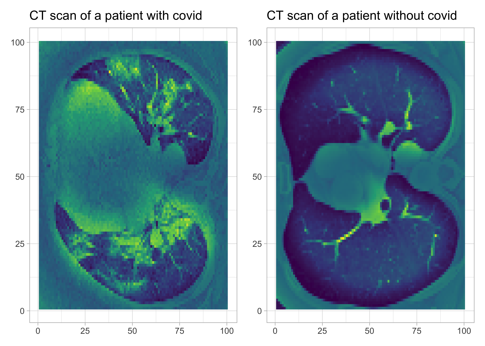
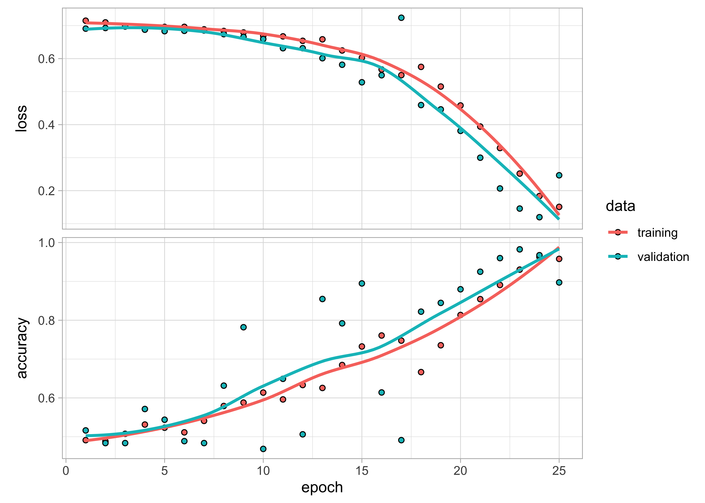

+++
date = "2022-01-02"
draft = false
tags = ["deep learning", "keras", "R", "rstats"]
title = "Binary image classification using Keras in R: Using CT scans to predict patients with Covid"
math = true
summary = """
"""

+++

Here I illustrate how to train a CNN with Keras in R to predict from patients' CT scans those who will develop severe illness from Covid. 

<!--more-->

# Motivation

Michael Blum [tweeted](https://twitter.com/mblum_g/status/1475940763716444161?s=20) about the [STOIC2021 - COVID-19 AI challenge](https://stoic2021.grand-challenge.org/stoic2021/). The main goal of this challenge is to predict from the patients' [CT scans](https://en.wikipedia.org/wiki/CT_scan) who will develop severe disease. 

Given my [recent interest in machine learning](https://oliviergimenez.github.io/blog/learning-machine-learning/), this challenge peaked my interest. Although `Python` is the machine learning *lingua franca*, it is possible to [train a convolutional neural network (CNN) in `R`](https://github.com/oliviergimenez/computo-deeplearning-occupany-lynx) and perform (binary) image classification.

Here, I will use an [`R` interface to `Keras`](https://keras.rstudio.com/) that allows training neural networks. The other thing is that the [dataset shared for the challenge](https://stoic2021.grand-challenge.org/stoic-db/) is big, like 280Go big. It took me a day to download it. For the sake of illustration, I will use a similar but much lighter dataset from a [Kaggle](https://en.wikipedia.org/wiki/Kaggle) repository <https://www.kaggle.com/plameneduardo/sarscov2-ctscan-dataset>. 

The code is available on GitHub as usual <https://github.com/oliviergimenez/bin-image-classif>. 

First things first, load the packages we will need.

```r
library(tidyverse)
theme_set(theme_light())
library(keras)
```

# Read in and process data

We will need a function to process images, I'm stealing [that one](https://rpubs.com/spalladino14/653239) written by [Spencer Palladino](https://www.linkedin.com/in/spencer-palladino/).

```r
process_pix <- function(lsf) {
  img <- lapply(lsf, image_load, grayscale = TRUE) # grayscale the image
  arr <- lapply(img, image_to_array) # turns it into an array
  arr_resized <- lapply(arr, image_array_resize, 
                        height = 100, 
                        width = 100) # resize
  arr_normalized <- normalize(arr_resized, axis = 1) #normalize to make small numbers 
  return(arr_normalized)
}
```

Process pix for patients with Covid, and reshape. Idem for pix for patients without Covid. 

```r
# with covid
lsf <- list.files("dat/COVID/", full.names = TRUE) 
covid <- process_pix(lsf)
covid <- covid[,,,1] # get rid of last dim
covid_reshaped <- array_reshape(covid, c(nrow(covid), 100*100))
# without covid
lsf <- list.files("dat/non-COVID/", full.names = TRUE) 
ncovid <- process_pix(lsf)
ncovid <- ncovid[,,,1] # get rid of last dim
ncovid_reshaped <- array_reshape(ncovid, c(nrow(ncovid), 100*100))
```

We have 1252 CT scans of patients with Covid, and 1229 without. 

Let's visualise these scans. Let's pick a patient with Covid, and another one without.

```r
scancovid <- reshape2::melt(covid[10,,])
plotcovid <- scancovid %>%
  ggplot() +
  aes(x = Var1, y = Var2, fill = value) + 
  geom_raster() +
  labs(x = NULL, y = NULL, title = "CT scan of a patient with covid") + 
  scale_fill_viridis_c() + 
  theme(legend.position = "none")

scanncovid <- reshape2::melt(ncovid[10,,])
plotncovid <- scanncovid %>%
  ggplot() +
  aes(x = Var1, y = Var2, fill = value) + 
  geom_raster() +
  labs(x = NULL, y = NULL, title = "CT scan of a patient without covid") + 
  scale_fill_viridis_c() + 
  theme(legend.position = "none")

library(patchwork)
plotcovid + plotncovid
```

<!-- -->

Put altogether and shuffle.

```r
df <- rbind(cbind(covid_reshaped, 1), # 1 = covid
            cbind(ncovid_reshaped, 0)) # 0 = no covid
set.seed(1234)
shuffle <- sample(nrow(df), replace = F)
df <- df[shuffle, ]
```

Sounds great. We have everything we need to start training our convolutional neural network model. 

# Convolutional neural network (CNN)

Build our training and testing datasets using a 80/20 split. 

```r
set.seed(2022)
split <- sample(2, nrow(df), replace = T, prob = c(0.8, 0.2))
train <- df[split == 1,]
test <- df[split == 2,]
train_target <- df[split == 1, 10001] # label in training dataset
test_target <- df[split == 2, 10001] # label in testing dataset
```

Build our model. I use a single layer, but it's easy to pipe others on top of it. 

```r
model <- keras_model_sequential() %>%
  layer_dense(units = 512, activation = "relu") %>% 
  layer_dropout(0.4) %>%
  layer_dense(units = 256, activation = "relu") %>%
  layer_dropout(0.3) %>%
  layer_dense(units = 128, activation = "relu") %>%
  layer_dropout(0.2) %>%
  layer_dense(units = 2, activation = 'softmax')
```

Compile it.

```r
model %>%
  compile(optimizer = 'adam',
          loss = 'binary_crossentropy', 
          metrics = c('accuracy'))
```

We use one-hot encoding with function `to_categorical()`, aka dumming coding in statistics.

```r
train_label <- to_categorical(train_target)
test_label <- to_categorical(test_target)
```

Now fit model. 

```r
fit_covid <- model %>%
  fit(x = train,
      y = train_label, 
      epochs = 25,
      batch_size = 512, # try also 256, 512
      verbose = 2,
      validation_split = 0.2)
```

Visualize performances. Not too bad. No over/under-fitting. Accuracy and loss are fine.

```r
plot(fit_covid)
```

<!-- -->

Performance on test dataset?

```r
model %>%
  evaluate(test, test_label)
```

```
##      loss  accuracy 
## 0.2800467 0.8612245
```

Let's do some predictions on the test data, and compare with ground truth. 

```r
predictedclasses <- model %>%
  predict_classes(test)
table(Prediction = predictedclasses, 
      Actual = test_target)
```

```
##           Actual
## Prediction   0   1
##          0 176   0
##          1  68 246
```

Pretty cool. Only a few patients are misclassified. Let's save our model for further use. 

```r
save_model_tf(model, "model/covidmodel") # save the model
```

I'm happy with the results. In general however, we need to find ways to improve the performances. A few tips [here](https://machinelearningmastery.com/improve-deep-learning-performance/) with examples implemented in `Keras` with `R` [there](https://keras.rstudio.com/articles/examples/index.html).
