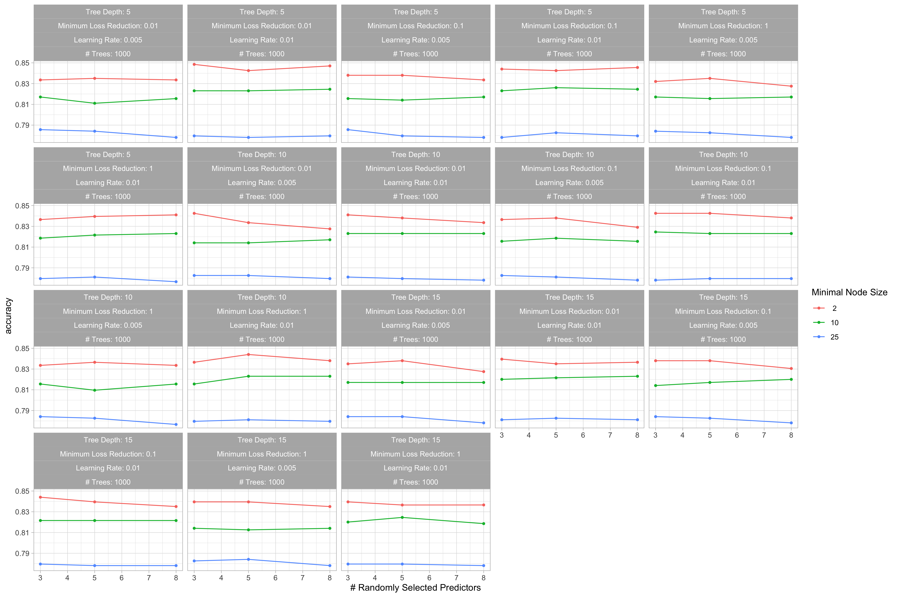
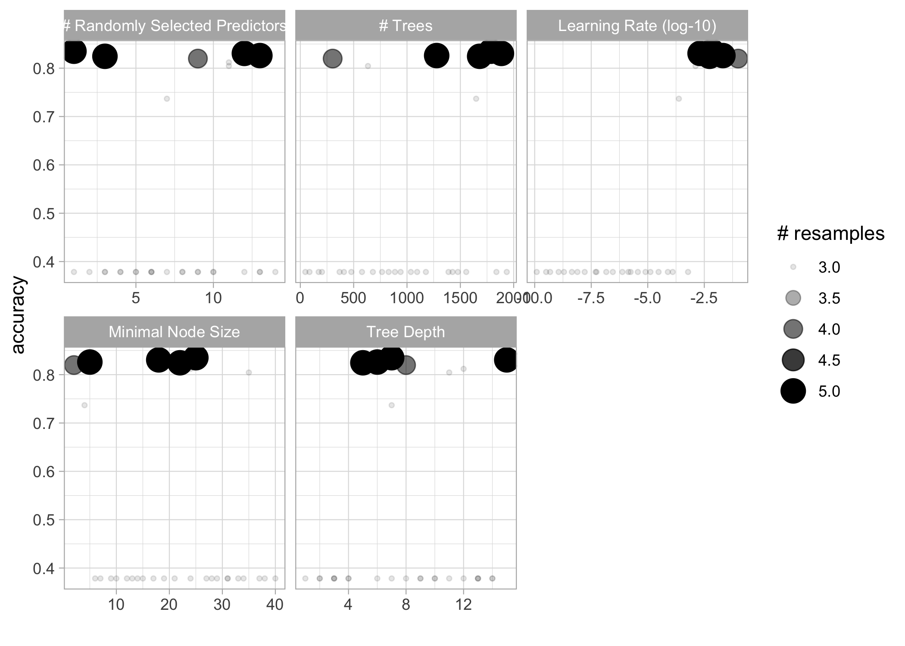

+++
date = "2021-08-13"
draft = false
tags = ["machine learning", "tidymodels", "R", "rstats"]
title = "Experimenting with machine learning in R with tidymodels and the Kaggle titanic dataset"
math = true
summary = """
"""

+++

I would like to familiarize myself with machine learning (ML) techniques in `R`. So I have been reading and learning by doing. I thought I'd share my experience for others who'd like to give it a try[^1].

[^1]: This post was also published on https://www.r-bloggers.com.

<!--more-->

# First version August 13, 2021, updated August 23, 2021

Since my first post, I’ve been reading notebooks shared by folks who
ranked high in the challenge, and added two features that they used.
Eventually, these new predictors did not help (I must be doing something
wrong). I also explored some other ML algorithms. Last, I tuned the
parameters more efficiently with a clever grid-search algorithm. All in
all, I slightly improved my score, but most importantly, I now have a
clean template for further use.

# Motivation

All material available from GitHub at
<https://github.com/oliviergimenez/learning-machine-learning>.

The two great books I’m using are:

-   [An Introduction to Statistical Learning with Applications in
    R](https://www.statlearning.com/) by Gareth James, Daniela Witten,
    Trevor Hastie and Robert Tibshirani

-   [Tidy models in R](https://www.tmwr.org/) by Max Kuhn and Julia
    Silge

I also recommend checking out the material (codes, screencasts) shared
by [David Robinson](http://varianceexplained.org/r/sliced-ml/) and
[Julia Silge](https://juliasilge.com/) from whom I picked some useful
tricks that I put to use below.

To try things, I’ve joined the
[Kaggle](https://en.wikipedia.org/wiki/Kaggle) online community which
gathers folks with lots of experience in ML from whom you can learn.
Kaggle also hosts public datasets that can be used for playing around.

I use the `tidymodels` metapackage that contains a suite of packages for
modeling and machine learning using `tidyverse` principles. Check out
all possibilities [here](https://www.tidymodels.org/find/), and parsnip
models in particular [there](https://www.tidymodels.org/find/parsnip/).

Let’s start with the famous [Titanic
dataset](https://www.kaggle.com/c/titanic/overview). We need to predict
if a passenger survived the sinking of the Titanic (1) or not (0). A
dataset is provided for training our models (train.csv). Another dataset
is provided (test.csv) for which we do not know the answer. We will
predict survival for each passenger, submit our answer to Kaggle and see
how well we did compared to other folks. The metric for comparison is
the percentage of passengers we correctly predict – aka as accuracy.

First things first, let’s load some packages to get us started.

    library(tidymodels) # metapackage for ML 
    library(tidyverse) # metapackage for data manipulation and visulaisation
    library(stacks) # stack ML models for better perfomance
    theme_set(theme_light())
    doParallel::registerDoParallel(cores = 4) # parallel computations

# Data

Read in training data.

    rawdata <- read_csv("dat/titanic/train.csv")
    glimpse(rawdata)

    ## Rows: 891
    ## Columns: 12
    ## $ PassengerId <dbl> 1, 2, 3, 4, 5, 6, 7, 8, 9, 10, 11, 12, 13, 14, 15, 16, 17, 18, 19, 20…
    ## $ Survived    <dbl> 0, 1, 1, 1, 0, 0, 0, 0, 1, 1, 1, 1, 0, 0, 0, 1, 0, 1, 0, 1, 0, 1, 1, …
    ## $ Pclass      <dbl> 3, 1, 3, 1, 3, 3, 1, 3, 3, 2, 3, 1, 3, 3, 3, 2, 3, 2, 3, 3, 2, 2, 3, …
    ## $ Name        <chr> "Braund, Mr. Owen Harris", "Cumings, Mrs. John Bradley (Florence Brig…
    ## $ Sex         <chr> "male", "female", "female", "female", "male", "male", "male", "male",…
    ## $ Age         <dbl> 22, 38, 26, 35, 35, NA, 54, 2, 27, 14, 4, 58, 20, 39, 14, 55, 2, NA, …
    ## $ SibSp       <dbl> 1, 1, 0, 1, 0, 0, 0, 3, 0, 1, 1, 0, 0, 1, 0, 0, 4, 0, 1, 0, 0, 0, 0, …
    ## $ Parch       <dbl> 0, 0, 0, 0, 0, 0, 0, 1, 2, 0, 1, 0, 0, 5, 0, 0, 1, 0, 0, 0, 0, 0, 0, …
    ## $ Ticket      <chr> "A/5 21171", "PC 17599", "STON/O2. 3101282", "113803", "373450", "330…
    ## $ Fare        <dbl> 7.2500, 71.2833, 7.9250, 53.1000, 8.0500, 8.4583, 51.8625, 21.0750, 1…
    ## $ Cabin       <chr> NA, "C85", NA, "C123", NA, NA, "E46", NA, NA, NA, "G6", "C103", NA, N…
    ## $ Embarked    <chr> "S", "C", "S", "S", "S", "Q", "S", "S", "S", "C", "S", "S", "S", "S",…

    naniar::miss_var_summary(rawdata)

    ## # A tibble: 12 × 3
    ##    variable    n_miss pct_miss
    ##    <chr>        <int>    <dbl>
    ##  1 Cabin          687   77.1  
    ##  2 Age            177   19.9  
    ##  3 Embarked         2    0.224
    ##  4 PassengerId      0    0    
    ##  5 Survived         0    0    
    ##  6 Pclass           0    0    
    ##  7 Name             0    0    
    ##  8 Sex              0    0    
    ##  9 SibSp            0    0    
    ## 10 Parch            0    0    
    ## 11 Ticket           0    0    
    ## 12 Fare             0    0

After some data exploration (not shown), I decided to take care of
missing values, gather the two family variables in a single variable,
and create a variable title.

    # Get most frequent port of embarkation
    uniqx <- unique(na.omit(rawdata$Embarked))
    mode_embarked <- as.character(fct_drop(uniqx[which.max(tabulate(match(rawdata$Embarked, uniqx)))]))

    # Build function for data cleaning and handling NAs
    process_data <- function(tbl){
      
      tbl %>%
        mutate(class = case_when(Pclass == 1 ~ "first",
                                 Pclass == 2 ~ "second",
                                 Pclass == 3 ~ "third"),
               class = as_factor(class),
               gender = factor(Sex),
               fare = Fare,
               age = Age,
               ticket = Ticket,
               alone = if_else(SibSp + Parch == 0, "yes", "no"), # alone variable
               alone = as_factor(alone),
               port = factor(Embarked), # rename embarked as port
               title = str_extract(Name, "[A-Za-z]+\\."), # title variable
               title = fct_lump(title, 4)) %>% # keep only most frequent levels of title
        mutate(port = ifelse(is.na(port), mode_embarked, port), # deal w/ NAs in port (replace by mode)
               port = as_factor(port)) %>%
        group_by(title) %>%
        mutate(median_age_title = median(age, na.rm = T)) %>%
        ungroup() %>%
        mutate(age = if_else(is.na(age), median_age_title, age)) %>% # deal w/ NAs in age (replace by median in title)
        mutate(ticketfreq = ave(1:nrow(.), FUN = length),
               fareadjusted = fare / ticketfreq) %>%
        mutate(familyage = SibSp + Parch + 1 + age/70)
        
    }

    # Process the data
    dataset <- rawdata %>%
      process_data() %>%
      mutate(survived = as_factor(if_else(Survived == 1, "yes", "no"))) %>%
      mutate(survived = relevel(survived, ref = "yes")) %>% # first event is survived = yes
      select(survived, class, gender, age, alone, port, title, fareadjusted, familyage) 

    # Have a look again
    glimpse(dataset)

    ## Rows: 891
    ## Columns: 9
    ## $ survived     <fct> no, yes, yes, yes, no, no, no, no, yes, yes, yes, yes, no, no, no, y…
    ## $ class        <fct> third, first, third, first, third, third, first, third, third, secon…
    ## $ gender       <fct> male, female, female, female, male, male, male, male, female, female…
    ## $ age          <dbl> 22, 38, 26, 35, 35, 30, 54, 2, 27, 14, 4, 58, 20, 39, 14, 55, 2, 30,…
    ## $ alone        <fct> no, no, yes, no, yes, yes, yes, no, no, no, no, yes, yes, no, yes, y…
    ## $ port         <fct> 3, 1, 3, 3, 3, 2, 3, 3, 3, 1, 3, 3, 3, 3, 3, 3, 2, 3, 3, 1, 3, 3, 2,…
    ## $ title        <fct> Mr., Mrs., Miss., Mrs., Mr., Mr., Mr., Master., Mrs., Mrs., Miss., M…
    ## $ fareadjusted <dbl> 0.008136925, 0.080003704, 0.008894501, 0.059595960, 0.009034792, 0.0…
    ## $ familyage    <dbl> 2.314286, 2.542857, 1.371429, 2.500000, 1.500000, 1.428571, 1.771429…

    naniar::miss_var_summary(dataset)

    ## # A tibble: 9 × 3
    ##   variable     n_miss pct_miss
    ##   <chr>         <int>    <dbl>
    ## 1 survived          0        0
    ## 2 class             0        0
    ## 3 gender            0        0
    ## 4 age               0        0
    ## 5 alone             0        0
    ## 6 port              0        0
    ## 7 title             0        0
    ## 8 fareadjusted      0        0
    ## 9 familyage         0        0

Let’s apply the same treatment to the test dataset.

    rawdata <- read_csv("dat/titanic/test.csv") 
    holdout <- rawdata %>%
      process_data() %>%
      select(PassengerId, class, gender, age, alone, port, title, fareadjusted, familyage) 

    glimpse(holdout)

    ## Rows: 418
    ## Columns: 9
    ## $ PassengerId  <dbl> 892, 893, 894, 895, 896, 897, 898, 899, 900, 901, 902, 903, 904, 905…
    ## $ class        <fct> third, third, second, third, third, third, third, second, third, thi…
    ## $ gender       <fct> male, female, male, male, female, male, female, male, female, male, …
    ## $ age          <dbl> 34.5, 47.0, 62.0, 27.0, 22.0, 14.0, 30.0, 26.0, 18.0, 21.0, 28.5, 46…
    ## $ alone        <fct> yes, no, yes, yes, no, yes, yes, no, yes, no, yes, yes, no, no, no, …
    ## $ port         <fct> 2, 3, 2, 3, 3, 3, 2, 3, 1, 3, 3, 3, 3, 3, 3, 1, 2, 1, 3, 1, 1, 3, 3,…
    ## $ title        <fct> Mr., Mrs., Mr., Mr., Mrs., Mr., Miss., Mr., Mrs., Mr., Mr., Mr., Mrs…
    ## $ fareadjusted <dbl> 0.018730144, 0.016746411, 0.023175837, 0.020723684, 0.029395933, 0.0…
    ## $ familyage    <dbl> 1.492857, 2.671429, 1.885714, 1.385714, 3.314286, 1.200000, 1.428571…

    naniar::miss_var_summary(holdout)

    ## # A tibble: 9 × 3
    ##   variable     n_miss pct_miss
    ##   <chr>         <int>    <dbl>
    ## 1 fareadjusted      1    0.239
    ## 2 PassengerId       0    0    
    ## 3 class             0    0    
    ## 4 gender            0    0    
    ## 5 age               0    0    
    ## 6 alone             0    0    
    ## 7 port              0    0    
    ## 8 title             0    0    
    ## 9 familyage         0    0

# Exploratory data analysis

    skimr::skim(dataset)

<table>
<caption>Data summary</caption>
<tbody>
<tr class="odd">
<td style="text-align: left;">Name</td>
<td style="text-align: left;">dataset</td>
</tr>
<tr class="even">
<td style="text-align: left;">Number of rows</td>
<td style="text-align: left;">891</td>
</tr>
<tr class="odd">
<td style="text-align: left;">Number of columns</td>
<td style="text-align: left;">9</td>
</tr>
<tr class="even">
<td style="text-align: left;">_______________________</td>
<td style="text-align: left;"></td>
</tr>
<tr class="odd">
<td style="text-align: left;">Column type frequency:</td>
<td style="text-align: left;"></td>
</tr>
<tr class="even">
<td style="text-align: left;">factor</td>
<td style="text-align: left;">6</td>
</tr>
<tr class="odd">
<td style="text-align: left;">numeric</td>
<td style="text-align: left;">3</td>
</tr>
<tr class="even">
<td style="text-align: left;">________________________</td>
<td style="text-align: left;"></td>
</tr>
<tr class="odd">
<td style="text-align: left;">Group variables</td>
<td style="text-align: left;">None</td>
</tr>
</tbody>
</table>

Data summary

**Variable type: factor**

<table>
<thead>
<tr class="header">
<th style="text-align: left;">skim_variable</th>
<th style="text-align: right;">n_missing</th>
<th style="text-align: right;">complete_rate</th>
<th style="text-align: left;">ordered</th>
<th style="text-align: right;">n_unique</th>
<th style="text-align: left;">top_counts</th>
</tr>
</thead>
<tbody>
<tr class="odd">
<td style="text-align: left;">survived</td>
<td style="text-align: right;">0</td>
<td style="text-align: right;">1</td>
<td style="text-align: left;">FALSE</td>
<td style="text-align: right;">2</td>
<td style="text-align: left;">no: 549, yes: 342</td>
</tr>
<tr class="even">
<td style="text-align: left;">class</td>
<td style="text-align: right;">0</td>
<td style="text-align: right;">1</td>
<td style="text-align: left;">FALSE</td>
<td style="text-align: right;">3</td>
<td style="text-align: left;">thi: 491, fir: 216, sec: 184</td>
</tr>
<tr class="odd">
<td style="text-align: left;">gender</td>
<td style="text-align: right;">0</td>
<td style="text-align: right;">1</td>
<td style="text-align: left;">FALSE</td>
<td style="text-align: right;">2</td>
<td style="text-align: left;">mal: 577, fem: 314</td>
</tr>
<tr class="even">
<td style="text-align: left;">alone</td>
<td style="text-align: right;">0</td>
<td style="text-align: right;">1</td>
<td style="text-align: left;">FALSE</td>
<td style="text-align: right;">2</td>
<td style="text-align: left;">yes: 537, no: 354</td>
</tr>
<tr class="odd">
<td style="text-align: left;">port</td>
<td style="text-align: right;">0</td>
<td style="text-align: right;">1</td>
<td style="text-align: left;">FALSE</td>
<td style="text-align: right;">4</td>
<td style="text-align: left;">3: 644, 1: 168, 2: 77, S: 2</td>
</tr>
<tr class="even">
<td style="text-align: left;">title</td>
<td style="text-align: right;">0</td>
<td style="text-align: right;">1</td>
<td style="text-align: left;">FALSE</td>
<td style="text-align: right;">5</td>
<td style="text-align: left;">Mr.: 517, Mis: 182, Mrs: 125, Mas: 40</td>
</tr>
</tbody>
</table>

**Variable type: numeric**

<table>
<thead>
<tr class="header">
<th style="text-align: left;">skim_variable</th>
<th style="text-align: right;">n_missing</th>
<th style="text-align: right;">complete_rate</th>
<th style="text-align: right;">mean</th>
<th style="text-align: right;">sd</th>
<th style="text-align: right;">p0</th>
<th style="text-align: right;">p25</th>
<th style="text-align: right;">p50</th>
<th style="text-align: right;">p75</th>
<th style="text-align: right;">p100</th>
<th style="text-align: left;">hist</th>
</tr>
</thead>
<tbody>
<tr class="odd">
<td style="text-align: left;">age</td>
<td style="text-align: right;">0</td>
<td style="text-align: right;">1</td>
<td style="text-align: right;">29.39</td>
<td style="text-align: right;">13.26</td>
<td style="text-align: right;">0.42</td>
<td style="text-align: right;">21.00</td>
<td style="text-align: right;">30.00</td>
<td style="text-align: right;">35.00</td>
<td style="text-align: right;">80.00</td>
<td style="text-align: left;">▂▇▃▁▁</td>
</tr>
<tr class="even">
<td style="text-align: left;">fareadjusted</td>
<td style="text-align: right;">0</td>
<td style="text-align: right;">1</td>
<td style="text-align: right;">0.04</td>
<td style="text-align: right;">0.06</td>
<td style="text-align: right;">0.00</td>
<td style="text-align: right;">0.01</td>
<td style="text-align: right;">0.02</td>
<td style="text-align: right;">0.03</td>
<td style="text-align: right;">0.58</td>
<td style="text-align: left;">▇▁▁▁▁</td>
</tr>
<tr class="odd">
<td style="text-align: left;">familyage</td>
<td style="text-align: right;">0</td>
<td style="text-align: right;">1</td>
<td style="text-align: right;">2.32</td>
<td style="text-align: right;">1.57</td>
<td style="text-align: right;">1.07</td>
<td style="text-align: right;">1.41</td>
<td style="text-align: right;">1.57</td>
<td style="text-align: right;">2.62</td>
<td style="text-align: right;">11.43</td>
<td style="text-align: left;">▇▁▁▁▁</td>
</tr>
</tbody>
</table>

Let’s explore the data.

    dataset %>%
      count(survived)

    ## # A tibble: 2 × 2
    ##   survived     n
    ##   <fct>    <int>
    ## 1 yes        342
    ## 2 no         549

    dataset %>%
      group_by(gender) %>%
      summarize(n = n(),
                n_surv = sum(survived == "yes"),
                pct_surv = n_surv / n)

    ## # A tibble: 2 × 4
    ##   gender     n n_surv pct_surv
    ##   <fct>  <int>  <int>    <dbl>
    ## 1 female   314    233    0.742
    ## 2 male     577    109    0.189

    dataset %>%
      group_by(title) %>%
      summarize(n = n(),
                n_surv = sum(survived == "yes"),
                pct_surv = n_surv / n) %>%
      arrange(desc(pct_surv))

    ## # A tibble: 5 × 4
    ##   title       n n_surv pct_surv
    ##   <fct>   <int>  <int>    <dbl>
    ## 1 Mrs.      125     99    0.792
    ## 2 Miss.     182    127    0.698
    ## 3 Master.    40     23    0.575
    ## 4 Other      27     12    0.444
    ## 5 Mr.       517     81    0.157

    dataset %>%
      group_by(class, gender) %>%
      summarize(n = n(),
                n_surv = sum(survived == "yes"),
                pct_surv = n_surv / n) %>%
      arrange(desc(pct_surv))

    ## # A tibble: 6 × 5
    ## # Groups:   class [3]
    ##   class  gender     n n_surv pct_surv
    ##   <fct>  <fct>  <int>  <int>    <dbl>
    ## 1 first  female    94     91    0.968
    ## 2 second female    76     70    0.921
    ## 3 third  female   144     72    0.5  
    ## 4 first  male     122     45    0.369
    ## 5 second male     108     17    0.157
    ## 6 third  male     347     47    0.135

Some informative graphs.

    dataset %>%
      group_by(class, gender) %>%
      summarize(n = n(),
                n_surv = sum(survived == "yes"),
                pct_surv = n_surv / n) %>%
        mutate(class = fct_reorder(class, pct_surv)) %>%
        ggplot(aes(pct_surv, class, fill = class, color = class)) +
        geom_col(position = position_dodge()) +
        scale_x_continuous(labels = percent) +
        labs(x = "% in category that survived", fill = NULL, color = NULL, y = NULL) +
      facet_wrap(~gender)

    dataset %>%
      mutate(age = cut(age, breaks = c(0, 20, 40, 60, 80))) %>%
      group_by(age, gender) %>%
      summarize(n = n(),
                n_surv = sum(survived == "yes"),
                pct_surv = n_surv / n) %>%
        mutate(age = fct_reorder(age, pct_surv)) %>%
        ggplot(aes(pct_surv, age, fill = age, color = age)) +
        geom_col(position = position_dodge()) +
        scale_x_continuous(labels = percent) +
        labs(x = "% in category that survived", fill = NULL, color = NULL, y = NULL) +
      facet_wrap(~gender)

    dataset %>%
        ggplot(aes(fareadjusted, group = survived, color = survived, fill = survived)) +
        geom_histogram(alpha = .4, position = position_dodge()) +
        labs(x = "fare", y = NULL, color = "survived?", fill = "survived?")

    dataset %>%
        ggplot(aes(familyage, group = survived, color = survived, fill = survived)) +
        geom_histogram(alpha = .4, position = position_dodge()) +
        labs(x = "family aged", y = NULL, color = "survived?", fill = "survived?")

# Training/testing datasets

Split our dataset in two, one dataset for training and the other one for
testing. We will use an additionnal splitting step for cross-validation.

    set.seed(2021)
    spl <- initial_split(dataset, strata = "survived")
    train <- training(spl)
    test <- testing(spl)

    train_5fold <- train %>%
      vfold_cv(5)

# Gradient boosting algorithms - xgboost

Let’s start with [gradient boosting
methods](https://en.wikipedia.org/wiki/XGBoost) which are very popular
in the ML community.

## Tuning

Set up defaults.

    mset <- metric_set(accuracy) # metric is accuracy
    control <- control_grid(save_workflow = TRUE,
                            save_pred = TRUE,
                            extract = extract_model) # grid for tuning

First a recipe.

    xg_rec <- recipe(survived ~ ., data = train) %>%
      step_impute_median(all_numeric()) %>% # replace missing value by median
      step_dummy(all_nominal_predictors()) # all factors var are split into binary terms (factor disj coding)

Then specify a gradient boosting model.

    xg_model <- boost_tree(mode = "classification", # binary response
                           trees = tune(),
                           mtry = tune(),
                           tree_depth = tune(),
                           learn_rate = tune(),
                           loss_reduction = tune(),
                           min_n = tune()) # parameters to be tuned

Now set our workflow.

    xg_wf <- 
      workflow() %>% 
      add_model(xg_model) %>% 
      add_recipe(xg_rec)

Use cross-validation to evaluate our model with different param config.

    xg_tune <- xg_wf %>%
      tune_grid(train_5fold,
                metrics = mset,
                control = control,
                grid = crossing(trees = 1000,
                                mtry = c(3, 5, 8), # finalize(mtry(), train)
                                tree_depth = c(5, 10, 15),
                                learn_rate = c(0.01, 0.005),
                                loss_reduction = c(0.01, 0.1, 1),
                                min_n = c(2, 10, 25)))

Visualize the results.

    autoplot(xg_tune) + theme_light()

Collect metrics.

    xg_tune %>%
      collect_metrics() %>%
      arrange(desc(mean))

    ## # A tibble: 162 × 12
    ##     mtry trees min_n tree_depth learn_rate loss_reduction .metric  .estimator  mean     n
    ##    <dbl> <dbl> <dbl>      <dbl>      <dbl>          <dbl> <chr>    <chr>      <dbl> <int>
    ##  1     3  1000     2          5       0.01           0.01 accuracy binary     0.849     5
    ##  2     8  1000     2          5       0.01           0.01 accuracy binary     0.847     5
    ##  3     8  1000     2          5       0.01           0.1  accuracy binary     0.846     5
    ##  4     3  1000     2         15       0.01           0.1  accuracy binary     0.844     5
    ##  5     5  1000     2         10       0.01           1    accuracy binary     0.844     5
    ##  6     3  1000     2          5       0.01           0.1  accuracy binary     0.844     5
    ##  7     5  1000     2         10       0.01           0.1  accuracy binary     0.843     5
    ##  8     3  1000     2         10       0.01           0.1  accuracy binary     0.843     5
    ##  9     5  1000     2          5       0.01           0.01 accuracy binary     0.843     5
    ## 10     5  1000     2          5       0.01           0.1  accuracy binary     0.843     5
    ## # … with 152 more rows, and 2 more variables: std_err <dbl>, .config <chr>

The tuning takes some time. There are other ways to explore the
parameter space more efficiently. For example, we will use the function
[`dials::grid_max_entropy()`](https://dials.tidymodels.org/reference/grid_max_entropy.html)
in the last section about ensemble modelling. Here, I will use
[`finetune::tune_race_anova`](https://search.r-project.org/CRAN/refmans/finetune/html/tune_race_anova.html).

    library(finetune)
    xg_tune <-
      xg_wf %>%
      tune_race_anova(
        train_5fold,
        grid = 50,
        param_info = xg_model %>% parameters(),
        metrics = metric_set(accuracy),
        control = control_race(verbose_elim = TRUE))

Visualize the results.

    autoplot(xg_tune)

Collect metrics.

    xg_tune %>%
      collect_metrics() %>%
      arrange(desc(mean))

    ## # A tibble: 50 × 12
    ##     mtry trees min_n tree_depth learn_rate loss_reduction .metric  .estimator  mean     n
    ##    <int> <int> <int>      <int>      <dbl>          <dbl> <chr>    <chr>      <dbl> <int>
    ##  1     6   856     4         13   1.12e- 2       2.49e- 8 accuracy binary     0.837     5
    ##  2    10  1952     6          7   3.36e- 2       2.07e+ 0 accuracy binary     0.829     5
    ##  3     3   896     2          5   1.73e- 5       6.97e- 8 accuracy binary     0.826     5
    ##  4    14  1122     4          6   1.16e- 6       3.44e+ 0 accuracy binary     0.815     4
    ##  5     7   939     8          4   2.88e- 5       1.50e- 4 accuracy binary     0.813     4
    ##  6     7    17    10          7   4.54e- 6       6.38e- 3 accuracy binary     0.813     4
    ##  7     8    92     9         11   3.60e- 3       3.01e-10 accuracy binary     0.811     4
    ##  8    13  1407    15          4   1.48e- 2       9.68e- 4 accuracy binary     0.807     3
    ##  9     4   658    11          9   9.97e-10       1.27e- 5 accuracy binary     0.805     3
    ## 10     2   628    14          9   1.84e- 6       9.44e- 5 accuracy binary     0.798     3
    ## # … with 40 more rows, and 2 more variables: std_err <dbl>, .config <chr>

## Fit model

Use best config to fit model to training data.

    xg_fit <- xg_wf %>%
      finalize_workflow(select_best(xg_tune)) %>%
      fit(train)

    ## [23:39:25] WARNING: amalgamation/../src/learner.cc:1095: Starting in XGBoost 1.3.0, the default evaluation metric used with the objective 'binary:logistic' was changed from 'error' to 'logloss'. Explicitly set eval_metric if you'd like to restore the old behavior.

Check out accuracy on testing dataset to see if we overfitted.

    xg_fit %>%
      augment(test, type.predict = "response") %>%
      accuracy(survived, .pred_class)

    ## # A tibble: 1 × 3
    ##   .metric  .estimator .estimate
    ##   <chr>    <chr>          <dbl>
    ## 1 accuracy binary         0.812

Check out important features (aka predictors).

    importances <- xgboost::xgb.importance(model = extract_fit_engine(xg_fit))
    importances %>%
      mutate(Feature = fct_reorder(Feature, Gain)) %>%
      ggplot(aes(Gain, Feature)) +
      geom_col()

## Make predictions

Now we’re ready to predict survival for the holdout dataset and submit
to Kaggle. Note that I use the whole dataset, not just the training
dataset.

    xg_wf %>%
      finalize_workflow(select_best(xg_tune)) %>%
      fit(dataset) %>%
      augment(holdout) %>%
      select(PassengerId, Survived = .pred_class) %>%
      mutate(Survived = if_else(Survived == "yes", 1, 0)) %>%
      write_csv("output/titanic/xgboost.csv")

    ## [23:39:28] WARNING: amalgamation/../src/learner.cc:1095: Starting in XGBoost 1.3.0, the default evaluation metric used with the objective 'binary:logistic' was changed from 'error' to 'logloss'. Explicitly set eval_metric if you'd like to restore the old behavior.

I got and accuracy of 0.74162. Cool. Let’s train a random forest model
now.

# Random forests

Let’s continue with [random forest
methods](https://en.wikipedia.org/wiki/Random_forest).

## Tuning

First a recipe.

    rf_rec <- recipe(survived ~ ., data = train) %>%
      step_impute_median(all_numeric()) %>% # replace missing value by median
      step_dummy(all_nominal_predictors()) # all factors var are split into binary terms (factor disj coding)

Then specify a random forest model.

    rf_model <- rand_forest(mode = "classification", # binary response
                            engine = "ranger", # by default
                            mtry = tune(),
                            trees = tune(),
                            min_n = tune()) # parameters to be tuned

Now set our workflow.

    rf_wf <- 
      workflow() %>% 
      add_model(rf_model) %>% 
      add_recipe(rf_rec)

Use cross-validation to evaluate our model with different param config.

    rf_tune <-
      rf_wf %>%
      tune_race_anova(
        train_5fold,
        grid = 50,
        param_info = rf_model %>% parameters(),
        metrics = metric_set(accuracy),
        control = control_race(verbose_elim = TRUE))

Visualize the results.

    autoplot(rf_tune)

Collect metrics.

    rf_tune %>%
      collect_metrics() %>%
      arrange(desc(mean))

    ## # A tibble: 50 × 9
    ##     mtry trees min_n .metric  .estimator  mean     n std_err .config              
    ##    <int> <int> <int> <chr>    <chr>      <dbl> <int>   <dbl> <chr>                
    ##  1    14  1554     5 accuracy binary     0.837     5 0.00656 Preprocessor1_Model49
    ##  2     4   774    18 accuracy binary     0.837     5 0.0133  Preprocessor1_Model50
    ##  3     5  1736     8 accuracy binary     0.834     5 0.0111  Preprocessor1_Model46
    ##  4     8  1322     5 accuracy binary     0.832     5 0.00713 Preprocessor1_Model41
    ##  5     2  1078    30 accuracy binary     0.831     5 0.00727 Preprocessor1_Model12
    ##  6     4  1892    14 accuracy binary     0.831     5 0.00886 Preprocessor1_Model39
    ##  7     8   962     7 accuracy binary     0.829     5 0.00742 Preprocessor1_Model43
    ##  8     7   946     4 accuracy binary     0.826     5 0.00452 Preprocessor1_Model23
    ##  9     7  1262     3 accuracy binary     0.826     5 0.00710 Preprocessor1_Model47
    ## 10     9   544     9 accuracy binary     0.825     5 0.00673 Preprocessor1_Model11
    ## # … with 40 more rows

## Fit model

Use best config to fit model to training data.

    rf_fit <- rf_wf %>%
      finalize_workflow(select_best(rf_tune)) %>%
      fit(train)

Check out accuracy on testing dataset to see if we overfitted.

    rf_fit %>%
      augment(test, type.predict = "response") %>%
      accuracy(survived, .pred_class)

    ## # A tibble: 1 × 3
    ##   .metric  .estimator .estimate
    ##   <chr>    <chr>          <dbl>
    ## 1 accuracy binary         0.786

Check out important features (aka predictors).

    library(vip)
    finalize_model(
      x = rf_model,
      parameters = select_best(rf_tune)) %>%
      set_engine("ranger", importance = "permutation") %>%
      fit(survived ~ ., data = juice(prep(rf_rec))) %>%
      vip(geom = "point")

## Make predictions

Now we’re ready to predict survival for the holdout dataset and submit
to Kaggle.

    rf_wf %>%
      finalize_workflow(select_best(rf_tune)) %>%
      fit(dataset) %>%
      augment(holdout) %>%
      select(PassengerId, Survived = .pred_class) %>%
      mutate(Survived = if_else(Survived == "yes", 1, 0)) %>%
      write_csv("output/titanic/randomforest.csv")

I got and accuracy of 0.77990, a bit better than gradient boosting.

Let’s continue with [cat boosting
methods](https://en.wikipedia.org/wiki/Catboost).

# Gradient boosting algorithms - catboost

## Tuning

Set up defaults.

    mset <- metric_set(accuracy) # metric is accuracy
    control <- control_grid(save_workflow = TRUE,
                            save_pred = TRUE,
                            extract = extract_model) # grid for tuning

First a recipe.

    cb_rec <- recipe(survived ~ ., data = train) %>%
      step_impute_median(all_numeric()) %>% # replace missing value by median
      step_dummy(all_nominal_predictors()) # all factors var are split into binary terms (factor disj coding)

Then specify a cat boosting model.

    library(treesnip)
    cb_model <- boost_tree(mode = "classification",
                           engine = "catboost",
                           mtry = tune(),
                           trees = tune(),
                           min_n = tune(),
                           tree_depth = tune(),
                           learn_rate = tune()) # parameters to be tuned

Now set our workflow.

    cb_wf <- 
      workflow() %>% 
      add_model(cb_model) %>% 
      add_recipe(cb_rec)

Use cross-validation to evaluate our model with different param config.

    cb_tune <- cb_wf %>%
      tune_race_anova(
        train_5fold,
        grid = 30,
        param_info = cb_model %>% parameters(),
        metrics = metric_set(accuracy),
        control = control_race(verbose_elim = TRUE))

Visualize the results.

    autoplot(cb_tune)

Collect metrics.

    cb_tune %>%
      collect_metrics() %>%
      arrange(desc(mean))

    ## # A tibble: 30 × 11
    ##     mtry trees min_n tree_depth learn_rate .metric  .estimator  mean     n std_err .config 
    ##    <int> <int> <int>      <int>      <dbl> <chr>    <chr>      <dbl> <int>   <dbl> <chr>   
    ##  1     1  1787    25          7   6.84e- 3 accuracy binary     0.835     5 0.0125  Preproc…
    ##  2    12  1885    18         15   2.06e- 3 accuracy binary     0.831     5 0.00602 Preproc…
    ##  3    13  1278     5          6   2.10e- 2 accuracy binary     0.826     5 0.00431 Preproc…
    ##  4     3  1681    22          5   5.42e- 3 accuracy binary     0.825     5 0.00507 Preproc…
    ##  5     9   303     2          8   9.94e- 2 accuracy binary     0.820     4 0.0120  Preproc…
    ##  6    11  1201    24         12   3.77e- 2 accuracy binary     0.812     3 0.00868 Preproc…
    ##  7    11   634    35         11   1.30e- 3 accuracy binary     0.805     3 0.0242  Preproc…
    ##  8     7  1648     4          7   2.38e- 4 accuracy binary     0.737     3 0.0115  Preproc…
    ##  9     1  1427    27         10   1.74e- 6 accuracy binary     0.378     3 0.0152  Preproc…
    ## 10     2   940    19          3   3.20e-10 accuracy binary     0.378     3 0.0152  Preproc…
    ## # … with 20 more rows

## Fit model

Use best config to fit model to training data.

    cb_fit <- cb_wf %>%
      finalize_workflow(select_best(cb_tune)) %>%
      fit(train)

Check out accuracy on testing dataset to see if we overfitted.

    cb_fit %>%
      augment(test, type.predict = "response") %>%
      accuracy(survived, .pred_class)

    ## # A tibble: 1 × 3
    ##   .metric  .estimator .estimate
    ##   <chr>    <chr>          <dbl>
    ## 1 accuracy binary         0.808

## Make predictions

Now we’re ready to predict survival for the holdout dataset and submit
to Kaggle.

    cb_wf %>%
      finalize_workflow(select_best(cb_tune)) %>%
      fit(dataset) %>%
      augment(holdout) %>%
      select(PassengerId, Survived = .pred_class) %>%
      mutate(Survived = if_else(Survived == "yes", 1, 0)) %>%
      write_csv("output/titanic/catboost.csv")

I got and accuracy of 0.76076. Cool.

# Regularization methods

Let’s continue with [elastic net
regularization](https://en.wikipedia.org/wiki/Elastic_net_regularization).

## Tuning

First a recipe.

    en_rec <- recipe(survived ~ ., data = train) %>%
      step_impute_median(all_numeric()) %>% # replace missing value by median
      step_normalize(all_numeric_predictors()) %>% # normalize
      step_dummy(all_nominal_predictors()) # all factors var are split into binary terms (factor disj coding)

Then specify a regularization model. We tune parameter mixture, with
ridge regression for mixture = 0, and lasso for mixture = 1.

    en_model <- logistic_reg(penalty = tune(), 
                             mixture = tune()) %>% # param to be tuned
      set_engine("glmnet") %>% # elastic net
      set_mode("classification") # binary response

Now set our workflow.

    en_wf <- 
      workflow() %>% 
      add_model(en_model) %>% 
      add_recipe(en_rec)

Use cross-validation to evaluate our model with different param config.

    en_tune <- en_wf %>%
      tune_grid(train_5fold,
                metrics = mset,
                control = control,
                grid = crossing(penalty = 10 ^ seq(-8, -.5, .5),
                                mixture = seq(0, 1, length.out = 10)))

Visualize the results.

    autoplot(en_tune)

Collect metrics.

    en_tune %>%
      collect_metrics() %>%
      arrange(desc(mean))

    ## # A tibble: 160 × 8
    ##         penalty mixture .metric  .estimator  mean     n std_err .config               
    ##           <dbl>   <dbl> <chr>    <chr>      <dbl> <int>   <dbl> <chr>                 
    ##  1 0.00000001     0.111 accuracy binary     0.831     5  0.0112 Preprocessor1_Model017
    ##  2 0.0000000316   0.111 accuracy binary     0.831     5  0.0112 Preprocessor1_Model018
    ##  3 0.0000001      0.111 accuracy binary     0.831     5  0.0112 Preprocessor1_Model019
    ##  4 0.000000316    0.111 accuracy binary     0.831     5  0.0112 Preprocessor1_Model020
    ##  5 0.000001       0.111 accuracy binary     0.831     5  0.0112 Preprocessor1_Model021
    ##  6 0.00000316     0.111 accuracy binary     0.831     5  0.0112 Preprocessor1_Model022
    ##  7 0.00001        0.111 accuracy binary     0.831     5  0.0112 Preprocessor1_Model023
    ##  8 0.0000316      0.111 accuracy binary     0.831     5  0.0112 Preprocessor1_Model024
    ##  9 0.0001         0.111 accuracy binary     0.831     5  0.0112 Preprocessor1_Model025
    ## 10 0.000316       0.111 accuracy binary     0.831     5  0.0112 Preprocessor1_Model026
    ## # … with 150 more rows

## Fit model

Use best config to fit model to training data.

    en_fit <- en_wf %>%
      finalize_workflow(select_best(en_tune)) %>%
      fit(train)

Check out accuracy on testing dataset to see if we overfitted.

    en_fit %>%
      augment(test, type.predict = "response") %>%
      accuracy(survived, .pred_class)

    ## # A tibble: 1 × 3
    ##   .metric  .estimator .estimate
    ##   <chr>    <chr>          <dbl>
    ## 1 accuracy binary         0.826

Check out important features (aka predictors).

    library(broom)
    en_fit$fit$fit$fit %>%
      tidy() %>%
      filter(lambda >= select_best(en_tune)$penalty) %>%
      filter(lambda == min(lambda),
             term != "(Intercept)") %>%
      mutate(term = fct_reorder(term, estimate)) %>%
      ggplot(aes(estimate, term, fill = estimate > 0)) +
      geom_col() +
      theme(legend.position = "none")

## Make predictions

Now we’re ready to predict survival for the holdout dataset and submit
to Kaggle.

    en_wf %>%
      finalize_workflow(select_best(en_tune)) %>%
      fit(dataset) %>%
      augment(holdout) %>%
      select(PassengerId, Survived = .pred_class) %>%
      mutate(Survived = if_else(Survived == "yes", 1, 0)) %>%
      write_csv("output/titanic/regularization.csv")

I got and accuracy of 0.76315.

# Logistic regression

And what about a good old-fashioned logistic regression (not a ML algo)?

First a recipe.

    logistic_rec <- recipe(survived ~ ., data = train) %>%
      step_impute_median(all_numeric()) %>% # replace missing value by median
      step_normalize(all_numeric_predictors()) %>% # normalize
      step_dummy(all_nominal_predictors()) # all factors var are split into binary terms (factor disj coding)

Then specify a logistic regression.

    logistic_model <- logistic_reg() %>% # no param to be tuned
      set_engine("glm") %>% # elastic net
      set_mode("classification") # binary response

Now set our workflow.

    logistic_wf <- 
      workflow() %>% 
      add_model(logistic_model) %>% 
      add_recipe(logistic_rec)

Fit model.

    logistic_fit <- logistic_wf %>%
      fit(train)

Inspect significant features (aka predictors).

    tidy(logistic_fit, exponentiate = TRUE) %>%
      filter(p.value < 0.05)

    ## # A tibble: 6 × 5
    ##   term         estimate std.error statistic       p.value
    ##   <chr>           <dbl>     <dbl>     <dbl>         <dbl>
    ## 1 age             1.35      0.152      1.98 0.0473       
    ## 2 familyage       2.97      0.223      4.88 0.00000105   
    ## 3 class_first     0.136     0.367     -5.43 0.0000000559 
    ## 4 class_second    0.386     0.298     -3.19 0.00145      
    ## 5 title_Mr.      51.0       0.684      5.75 0.00000000912
    ## 6 title_Other    54.7       0.991      4.04 0.0000538

Same thing, but graphically.

    library(broom)
    logistic_fit %>%
      tidy() %>%
      mutate(term = fct_reorder(term, estimate)) %>%
      ggplot(aes(estimate, term, fill = estimate > 0)) +
      geom_col() +
      theme(legend.position = "none")

Check out accuracy on testing dataset to see if we overfitted.

    logistic_fit %>%
      augment(test, type.predict = "response") %>%
      accuracy(survived, .pred_class)

    ## # A tibble: 1 × 3
    ##   .metric  .estimator .estimate
    ##   <chr>    <chr>          <dbl>
    ## 1 accuracy binary         0.821

Confusion matrix.

    logistic_fit %>%
      augment(test, type.predict = "response") %>%
      conf_mat(survived, .pred_class)

    ##           Truth
    ## Prediction yes  no
    ##        yes  59  13
    ##        no   27 125

ROC curve.

    logistic_fit %>%
      augment(test, type.predict = "response") %>%
      roc_curve(truth = survived, estimate = .pred_yes) %>%
      autoplot()

Now we’re ready to predict survival for the holdout dataset and submit
to Kaggle.

    logistic_wf %>%
      fit(dataset) %>%
      augment(holdout) %>%
      select(PassengerId, Survived = .pred_class) %>%
      mutate(Survived = if_else(Survived == "yes", 1, 0)) %>%
      write_csv("output/titanic/logistic.csv")

I got and accuracy of 0.76076. Oldies but goodies!

# Neural networks

We go on with [neural
networks](https://en.wikipedia.org/wiki/Artificial_neural_network).

## Tuning

Set up defaults.

    mset <- metric_set(accuracy) # metric is accuracy
    control <- control_grid(save_workflow = TRUE,
                            save_pred = TRUE,
                            extract = extract_model) # grid for tuning

First a recipe.

    nn_rec <- recipe(survived ~ ., data = train) %>%
      step_impute_median(all_numeric()) %>% # replace missing value by median
      step_normalize(all_numeric_predictors()) %>%
      step_dummy(all_nominal_predictors()) # all factors var are split into binary terms (factor disj coding)

Then specify a neural network.

    nn_model <- mlp(epochs = tune(), 
                    hidden_units = tune(), 
                    dropout = tune()) %>% # param to be tuned
      set_mode("classification") %>% # binary response var
      set_engine("keras", verbose = 0)

Now set our workflow.

    nn_wf <- 
      workflow() %>% 
      add_model(nn_model) %>% 
      add_recipe(nn_rec)

Use cross-validation to evaluate our model with different param config.

    nn_tune <- nn_wf %>%
      tune_race_anova(
        train_5fold,
        grid = 30,
        param_info = nn_model %>% parameters(),
        metrics = metric_set(accuracy),
        control = control_race(verbose_elim = TRUE))

Visualize the results.

    autoplot(nn_tune)

Collect metrics.

    nn_tune %>%
      collect_metrics() %>%
      arrange(desc(mean))

    ## # A tibble: 30 × 9
    ##    hidden_units dropout epochs .metric  .estimator  mean     n std_err .config             
    ##           <int>   <dbl>  <int> <chr>    <chr>      <dbl> <int>   <dbl> <chr>               
    ##  1           10 0.484      405 accuracy binary     0.838     5 0.0150  Preprocessor1_Model…
    ##  2            7 0.0597     220 accuracy binary     0.834     5 0.00881 Preprocessor1_Model…
    ##  3            4 0.536      629 accuracy binary     0.834     5 0.0154  Preprocessor1_Model…
    ##  4            9 0.198      768 accuracy binary     0.832     5 0.0146  Preprocessor1_Model…
    ##  5            6 0.752      822 accuracy binary     0.832     5 0.0112  Preprocessor1_Model…
    ##  6            9 0.406      293 accuracy binary     0.831     5 0.0145  Preprocessor1_Model…
    ##  7            4 0.00445    871 accuracy binary     0.831     5 0.0150  Preprocessor1_Model…
    ##  8            4 0.293      353 accuracy binary     0.831     5 0.0117  Preprocessor1_Model…
    ##  9           10 0.675      935 accuracy binary     0.831     5 0.0141  Preprocessor1_Model…
    ## 10            7 0.128      580 accuracy binary     0.831     5 0.0151  Preprocessor1_Model…
    ## # … with 20 more rows

## Fit model

Use best config to fit model to training data.

    nn_fit <- nn_wf %>%
      finalize_workflow(select_best(nn_tune)) %>%
      fit(train)

Check out accuracy on testing dataset to see if we overfitted.

    nn_fit %>%
      augment(test, type.predict = "response") %>%
      accuracy(survived, .pred_class)

    ## # A tibble: 1 × 3
    ##   .metric  .estimator .estimate
    ##   <chr>    <chr>          <dbl>
    ## 1 accuracy binary         0.817

## Make predictions

Now we’re ready to predict survival for the holdout dataset and submit
to Kaggle.

    nn_wf %>%
      finalize_workflow(select_best(nn_tune)) %>%
      fit(train) %>%
      augment(holdout) %>%
      select(PassengerId, Survived = .pred_class) %>%
      mutate(Survived = if_else(Survived == "yes", 1, 0)) %>%
      write_csv("output/titanic/nn.csv")

I got and accuracy of 0.78708. My best score so far.

# Support vector machines

We go on with [support vector
machines](https://en.wikipedia.org/wiki/Support-vector_machine).

## Tuning

Set up defaults.

    mset <- metric_set(accuracy) # metric is accuracy
    control <- control_grid(save_workflow = TRUE,
                            save_pred = TRUE,
                            extract = extract_model) # grid for tuning

First a recipe.

    svm_rec <- recipe(survived ~ ., data = train) %>%
      step_impute_median(all_numeric()) %>% # replace missing value by median
      # remove any zero variance predictors
      step_zv(all_predictors()) %>% 
      # remove any linear combinations
      step_lincomb(all_numeric()) %>%
      step_dummy(all_nominal_predictors()) # all factors var are split into binary terms (factor disj coding)

Then specify a svm.

    svm_model <- svm_rbf(cost = tune(), 
                         rbf_sigma = tune()) %>% # param to be tuned
      set_mode("classification") %>% # binary response var
      set_engine("kernlab")

Now set our workflow.

    svm_wf <- 
      workflow() %>% 
      add_model(svm_model) %>% 
      add_recipe(svm_rec)

Use cross-validation to evaluate our model with different param config.

    svm_tune <- svm_wf %>%
      tune_race_anova(
        train_5fold,
        grid = 30,
        param_info = svm_model %>% parameters(),
        metrics = metric_set(accuracy),
        control = control_race(verbose_elim = TRUE))

Visualize the results.

    autoplot(svm_tune)

Collect metrics.

    svm_tune %>%
      collect_metrics() %>%
      arrange(desc(mean))

    ## # A tibble: 30 × 8
    ##        cost    rbf_sigma .metric  .estimator  mean     n std_err .config              
    ##       <dbl>        <dbl> <chr>    <chr>      <dbl> <int>   <dbl> <chr>                
    ##  1 17.7     0.00183      accuracy binary     0.829     5 0.0101  Preprocessor1_Model05
    ##  2  0.741   0.0506       accuracy binary     0.823     5 0.0129  Preprocessor1_Model14
    ##  3  1.77    0.0429       accuracy binary     0.820     5 0.0143  Preprocessor1_Model08
    ##  4  0.229   0.0197       accuracy binary     0.808     3 0.00626 Preprocessor1_Model23
    ##  5  1.15    0.00285      accuracy binary     0.795     3 0.00867 Preprocessor1_Model28
    ##  6  0.00182 0.00000203   accuracy binary     0.613     3 0.0171  Preprocessor1_Model01
    ##  7  0.0477  0.714        accuracy binary     0.613     3 0.0171  Preprocessor1_Model02
    ##  8  6.60    0.0000294    accuracy binary     0.613     3 0.0171  Preprocessor1_Model03
    ##  9  0.00254 0.000636     accuracy binary     0.613     3 0.0171  Preprocessor1_Model04
    ## 10  0.00544 0.0000000647 accuracy binary     0.613     3 0.0171  Preprocessor1_Model06
    ## # … with 20 more rows

## Fit model

Use best config to fit model to training data.

    svm_fit <- svm_wf %>%
      finalize_workflow(select_best(svm_tune)) %>%
      fit(train)

Check out accuracy on testing dataset to see if we overfitted.

    svm_fit %>%
      augment(test, type.predict = "response") %>%
      accuracy(survived, .pred_class)

    ## # A tibble: 1 × 3
    ##   .metric  .estimator .estimate
    ##   <chr>    <chr>          <dbl>
    ## 1 accuracy binary         0.826

## Make predictions

Now we’re ready to predict survival for the holdout dataset and submit
to Kaggle.

    svm_wf %>%
      finalize_workflow(select_best(svm_tune)) %>%
      fit(dataset) %>%
      augment(holdout) %>%
      select(PassengerId, Survived = .pred_class) %>%
      mutate(Survived = if_else(Survived == "yes", 1, 0)) %>%
      write_csv("output/titanic/svm.csv")

I got and accuracy of 0.77511.

# Decision trees

We go on with [decision
trees](https://en.wikipedia.org/wiki/Decision_tree).

## Tuning

Set up defaults.

    mset <- metric_set(accuracy) # metric is accuracy
    control <- control_grid(save_workflow = TRUE,
                            save_pred = TRUE,
                            extract = extract_model) # grid for tuning

First a recipe.

    dt_rec <- recipe(survived ~ ., data = train) %>%
      step_impute_median(all_numeric()) %>% # replace missing value by median
      step_zv(all_predictors()) %>% 
      step_dummy(all_nominal_predictors()) # all factors var are split into binary terms (factor disj coding)

Then specify a decision tree model.

    library(baguette)
    dt_model <- bag_tree(cost_complexity = tune(),
                         tree_depth = tune(),
                         min_n = tune()) %>% # param to be tuned
      set_engine("rpart", times = 25) %>% # nb bootstraps
      set_mode("classification") # binary response var

Now set our workflow.

    dt_wf <- 
      workflow() %>% 
      add_model(dt_model) %>% 
      add_recipe(dt_rec)

Use cross-validation to evaluate our model with different param config.

    dt_tune <- dt_wf %>%
      tune_race_anova(
        train_5fold,
        grid = 30,
        param_info = dt_model %>% parameters(),
        metrics = metric_set(accuracy),
        control = control_race(verbose_elim = TRUE))

Visualize the results.

    autoplot(dt_tune)

Collect metrics.

    dt_tune %>%
      collect_metrics() %>%
      arrange(desc(mean))

    ## # A tibble: 30 × 9
    ##    cost_complexity tree_depth min_n .metric  .estimator  mean     n std_err .config        
    ##              <dbl>      <int> <int> <chr>    <chr>      <dbl> <int>   <dbl> <chr>          
    ##  1        3.02e- 7         13     7 accuracy binary     0.832     5 0.0130  Preprocessor1_…
    ##  2        3.43e- 3         14     4 accuracy binary     0.829     5 0.0145  Preprocessor1_…
    ##  3        5.75e- 5          5     7 accuracy binary     0.828     5 0.0126  Preprocessor1_…
    ##  4        2.13e- 6         14     5 accuracy binary     0.828     5 0.0108  Preprocessor1_…
    ##  5        1.34e- 5          5    35 accuracy binary     0.823     5 0.00654 Preprocessor1_…
    ##  6        4.47e- 5         13    10 accuracy binary     0.823     5 0.0120  Preprocessor1_…
    ##  7        1.42e- 2          4    25 accuracy binary     0.822     5 0.0121  Preprocessor1_…
    ##  8        4.54e-10         10    36 accuracy binary     0.822     5 0.0147  Preprocessor1_…
    ##  9        8.10e- 8         11    32 accuracy binary     0.822     5 0.0143  Preprocessor1_…
    ## 10        3.43e- 4         11    21 accuracy binary     0.820     5 0.0207  Preprocessor1_…
    ## # … with 20 more rows

## Fit model

Use best config to fit model to training data.

    dt_fit <- dt_wf %>%
      finalize_workflow(select_best(dt_tune)) %>%
      fit(train)

Check out accuracy on testing dataset to see if we overfitted.

    dt_fit %>%
      augment(test, type.predict = "response") %>%
      accuracy(survived, .pred_class)

    ## # A tibble: 1 × 3
    ##   .metric  .estimator .estimate
    ##   <chr>    <chr>          <dbl>
    ## 1 accuracy binary         0.808

## Make predictions

Now we’re ready to predict survival for the holdout dataset and submit
to Kaggle.

    dt_wf %>%
      finalize_workflow(select_best(dt_tune)) %>%
      fit(dataset) %>%
      augment(holdout) %>%
      select(PassengerId, Survived = .pred_class) %>%
      mutate(Survived = if_else(Survived == "yes", 1, 0)) %>%
      write_csv("output/titanic/dt.csv")

I got and accuracy of 0.76794.

# Stacked ensemble modelling

Let’s do some ensemble modelling with all algo but logistic and
catboost. Tune again with a probability-based metric. Start with
xgboost.

    library(finetune)
    library(stacks)
    # xgboost
    xg_rec <- recipe(survived ~ ., data = train) %>%
      step_impute_median(all_numeric()) %>% # replace missing value by median
      step_dummy(all_nominal_predictors()) # all factors var are split into binary terms (factor disj coding)
    xg_model <- boost_tree(mode = "classification", # binary response
                           trees = tune(),
                           mtry = tune(),
                           tree_depth = tune(),
                           learn_rate = tune(),
                           loss_reduction = tune(),
                           min_n = tune()) # parameters to be tuned
    xg_wf <- 
      workflow() %>% 
      add_model(xg_model) %>% 
      add_recipe(xg_rec)
    xg_grid <- grid_latin_hypercube(
      trees(),
      finalize(mtry(), train),
      tree_depth(),
      learn_rate(),
      loss_reduction(),
      min_n(),
      size = 30)
    xg_tune <- xg_wf %>%
      tune_grid(
        resamples = train_5fold,
        grid = xg_grid,
        metrics = metric_set(roc_auc),
        control = control_stack_grid())

Then random forests.

    # random forest
    rf_rec <- recipe(survived ~ ., data = train) %>%
      step_impute_median(all_numeric()) %>% 
      step_dummy(all_nominal_predictors()) 
    rf_model <- rand_forest(mode = "classification", # binary response
                            engine = "ranger", # by default
                            mtry = tune(),
                            trees = tune(),
                            min_n = tune()) # parameters to be tuned
    rf_wf <- 
      workflow() %>% 
      add_model(rf_model) %>% 
      add_recipe(rf_rec)
    rf_grid <- grid_latin_hypercube(
      finalize(mtry(), train),
      trees(),
      min_n(),
      size = 30)
    rf_tune <- rf_wf %>%
      tune_grid(
        resamples = train_5fold,
        grid = rf_grid,
        metrics = metric_set(roc_auc),
        control = control_stack_grid())

Regularisation methods (between ridge and lasso).

    # regularization methods
    en_rec <- recipe(survived ~ ., data = train) %>%
      step_impute_median(all_numeric()) %>% # replace missing value by median
      step_normalize(all_numeric_predictors()) %>% # normalize
      step_dummy(all_nominal_predictors()) 
    en_model <- logistic_reg(penalty = tune(), 
                             mixture = tune()) %>% # param to be tuned
      set_engine("glmnet") %>% # elastic net
      set_mode("classification") # binary response
    en_wf <- 
      workflow() %>% 
      add_model(en_model) %>% 
      add_recipe(en_rec)
    en_grid <- grid_latin_hypercube(
      penalty(),
      mixture(),
      size = 30)
    en_tune <- en_wf %>%
      tune_grid(
        resamples = train_5fold,
        grid = en_grid,
        metrics = metric_set(roc_auc),
        control = control_stack_grid())

Neural networks (takes time, so pick only a few values for illustration
purpose).

    # neural networks
    nn_rec <- recipe(survived ~ ., data = train) %>%
      step_impute_median(all_numeric()) %>% # replace missing value by median
      step_normalize(all_numeric_predictors()) %>%
      step_dummy(all_nominal_predictors()) 
    nn_model <- mlp(epochs = tune(), 
                    hidden_units = 2, 
                    dropout = tune()) %>% # param to be tuned
      set_mode("classification") %>% # binary response var
      set_engine("keras", verbose = 0)
    nn_wf <- 
      workflow() %>% 
      add_model(nn_model) %>% 
      add_recipe(nn_rec)
    # nn_grid <- grid_latin_hypercube(
    #   epochs(),
    #   hidden_units(),
    #   dropout(),
    #   size = 10)
    nn_tune <- nn_wf %>%
      tune_grid(
        resamples = train_5fold,
        grid = crossing(dropout = c(0.1, 0.2), epochs = c(250, 500, 1000)), # nn_grid
        metrics = metric_set(roc_auc),
        control = control_stack_grid())
    #autoplot(nn_tune)

Support vector machines.

    # support vector machines
    svm_rec <- recipe(survived ~ ., data = train) %>%
      step_impute_median(all_numeric()) %>% 
      step_normalize(all_numeric_predictors()) %>%
      step_dummy(all_nominal_predictors()) 
    svm_model <- svm_rbf(cost = tune(), 
                         rbf_sigma = tune()) %>% # param to be tuned
      set_mode("classification") %>% # binary response var
      set_engine("kernlab")
    svm_wf <- 
      workflow() %>% 
      add_model(svm_model) %>% 
      add_recipe(svm_rec)
    svm_grid <- grid_latin_hypercube(
      cost(),
      rbf_sigma(),
      size = 30)
    svm_tune <- svm_wf %>%
      tune_grid(
        resamples = train_5fold,
        grid = svm_grid,
        metrics = metric_set(roc_auc),
        control = control_stack_grid())

Last, decision trees.

    # decision trees
    dt_rec <- recipe(survived ~ ., data = train) %>%
      step_impute_median(all_numeric()) %>% 
      step_zv(all_predictors()) %>% 
      step_dummy(all_nominal_predictors()) 
    library(baguette)
    dt_model <- bag_tree(cost_complexity = tune(),
                         tree_depth = tune(),
                         min_n = tune()) %>% # param to be tuned
      set_engine("rpart", times = 25) %>% # nb bootstraps
      set_mode("classification") # binary response var
    dt_wf <- 
      workflow() %>% 
      add_model(dt_model) %>% 
      add_recipe(dt_rec)
    dt_grid <- grid_latin_hypercube(
      cost_complexity(),
      tree_depth(),
      min_n(),
      size = 30)
    dt_tune <- dt_wf %>%
      tune_grid(
        resamples = train_5fold,
        grid = dt_grid,
        metrics = metric_set(roc_auc),
        control = control_stack_grid())

Get best config.

    xg_best <- xg_tune %>% filter_parameters(parameters = select_best(xg_tune))
    rf_best <- rf_tune %>% filter_parameters(parameters = select_best(rf_tune))
    en_best <- en_tune %>% filter_parameters(parameters = select_best(en_tune))
    nn_best <- nn_tune %>% filter_parameters(parameters = select_best(nn_tune))
    svm_best <- svm_tune %>% filter_parameters(parameters = select_best(svm_tune))
    dt_best <- dt_tune %>% filter_parameters(parameters = select_best(dt_tune))

Do the stacked ensemble modelling.

Pile all models together.

    blended <- stacks() %>% # initialize
      add_candidates(en_best) %>% # add regularization model
      add_candidates(xg_best) %>% # add gradient boosting
      add_candidates(rf_best) %>% # add random forest
      add_candidates(nn_best) %>% # add neural network
      add_candidates(svm_best) %>% # add svm
      add_candidates(dt_best) # add decision trees
    blended

    ## # A data stack with 6 model definitions and 6 candidate members:
    ## #   en_best: 1 model configuration
    ## #   xg_best: 1 model configuration
    ## #   rf_best: 1 model configuration
    ## #   nn_best: 1 model configuration
    ## #   svm_best: 1 model configuration
    ## #   dt_best: 1 model configuration
    ## # Outcome: survived (factor)

Fit regularized model.

    blended_fit <- blended %>%
      blend_predictions() # fit regularized model

Visualise penalized model. Note that neural networks are dropped,
despite achieving best score when used in isolation. I’ll have to dig
into that.

    autoplot(blended_fit)

    autoplot(blended_fit, type = "members")

    autoplot(blended_fit, type = "weights")

Fit candidate members with non-zero stacking coef with full training
dataset.

    blended_regularized <- blended_fit %>%
      fit_members() 
    blended_regularized

    ## # A tibble: 3 × 3
    ##   member                type         weight
    ##   <chr>                 <chr>         <dbl>
    ## 1 .pred_no_en_best_1_12 logistic_reg  2.67 
    ## 2 .pred_no_dt_best_1_11 bag_tree      1.95 
    ## 3 .pred_no_rf_best_1_05 rand_forest   0.922

Perf on testing dataset?

    test %>%
      bind_cols(predict(blended_regularized, .)) %>%
      accuracy(survived, .pred_class)

    ## # A tibble: 1 × 3
    ##   .metric  .estimator .estimate
    ##   <chr>    <chr>          <dbl>
    ## 1 accuracy binary         0.826

Now predict.

    holdout %>%
      bind_cols(predict(blended_regularized, .)) %>%
      select(PassengerId, Survived = .pred_class) %>%
      mutate(Survived = if_else(Survived == "yes", 1, 0)) %>%
      write_csv("output/titanic/stacked.csv")

I got an 0.76076 accuracy.

# Conclusions

I covered several ML algorithms and logistic regression with the awesome
`tidymodels` metapackage in `R`. My scores at predicting Titanic
survivors were ok I guess. Some folks on Kaggle got a perfect accuracy,
so there is always room for improvement. Maybe better tuning, better
features (or predictors) or other algorithms would increase accuracy. Of
course, I forgot to use `set.seed()` so results are not exactly
reproducible.
