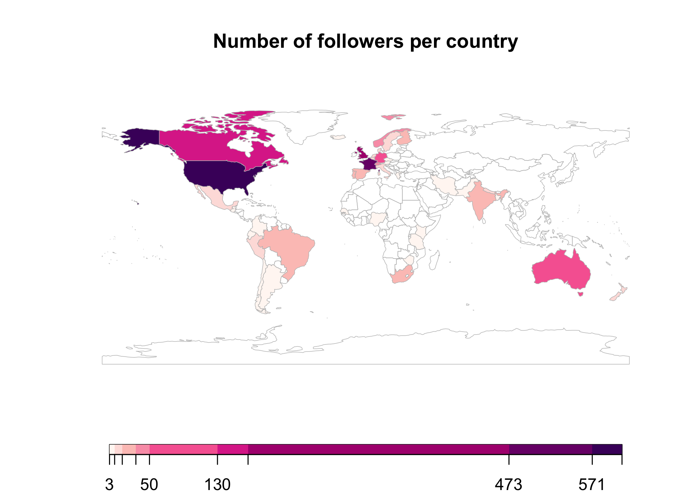
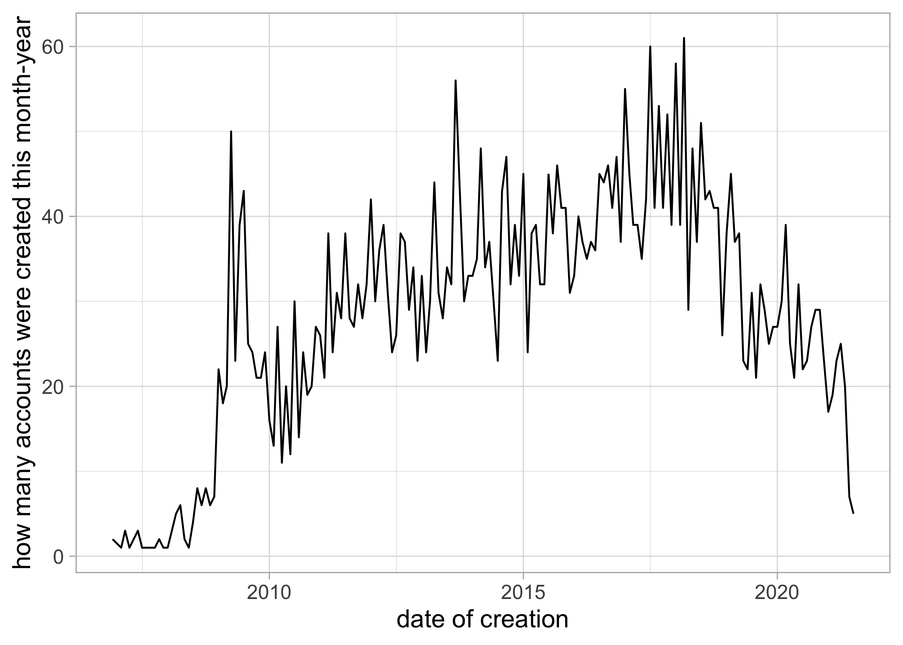
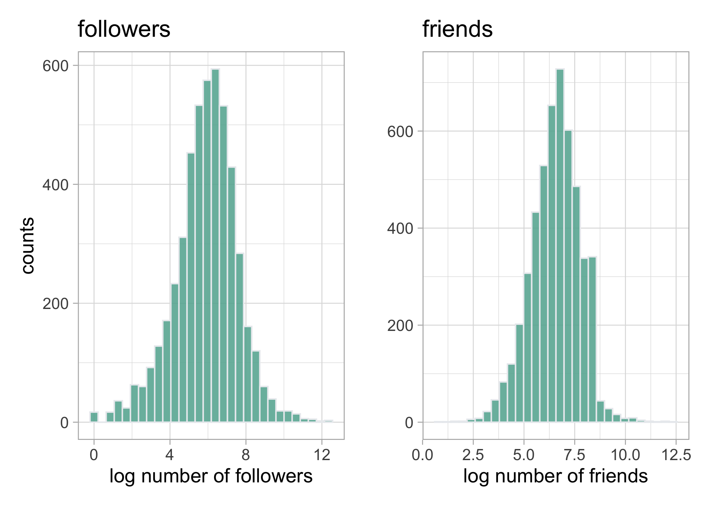
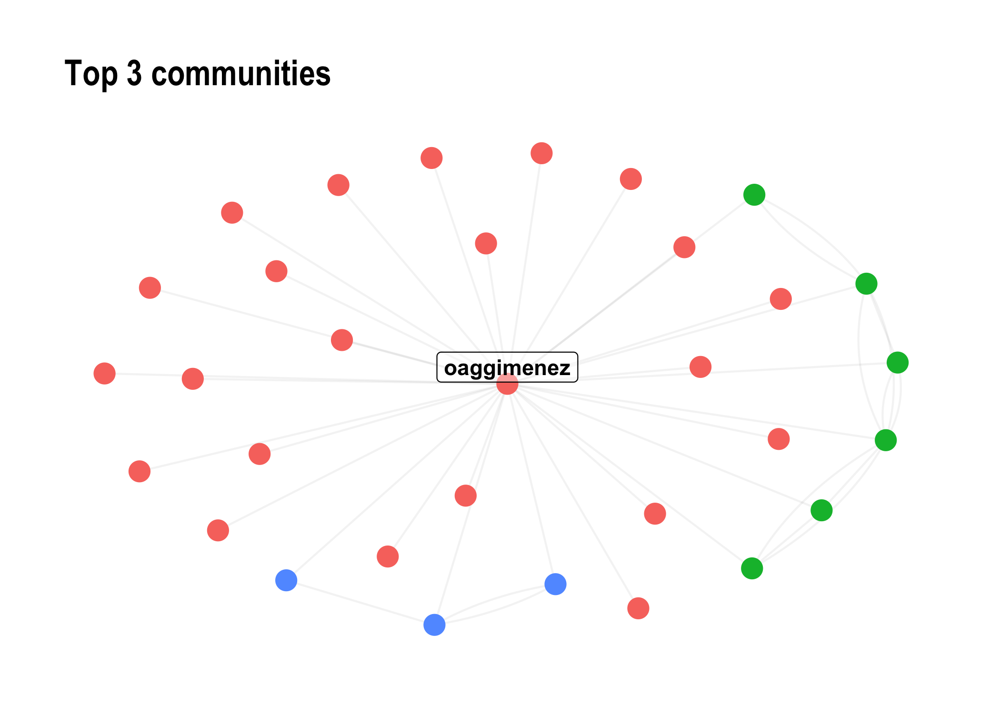
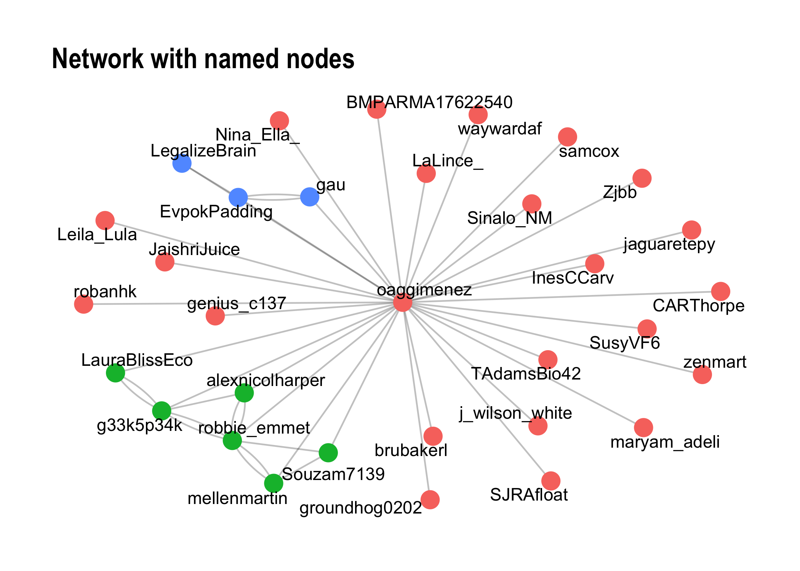

+++
date = "2021-07-28"
draft = false
tags = ["Twitter", "social network", "R", "rstats"]
title = "Quick and dirty analysis of a Twitter social network"
math = true
summary = """
"""

+++

I use `R` to retrieve some data from Twitter, do some exploratory data analysis and visualisation and examine a network of followers.

<!--more-->


## Motivation

I use Twitter to get live updates of what my follow scientists are up to, to communicate about my students' awesome work and to share material that I hope is useful to some people[^1].

[^1]: This post was also published on https://www.r-bloggers.com.

Recently, I reached 5,000 followers and I thought I'd spend some time trying to know better who they/you are. To do so, I use `R` to retrieve some data from Twitter using [`rtweet`](https://docs.ropensci.org/rtweet/), do some data exploration and visualisation using the [`tidyverse`](https://www.tidyverse.org/) and examine my network of followers with [`tidygraph`](https://tidygraph.data-imaginist.com/), [`ggraph`](https://ggraph.data-imaginist.com/) and [`igraph`](https://igraph.org/r/). Data and codes are available from <https://github.com/oliviergimenez/sna-twitter>. 

To reproduce the analyses below, you will need to access a Twitter API (application programming interface) to retrieve the information about your followers. In brief, an API is an intermediary application that allows applications to talk to each other. To access the Twitter APIs, you need a developer account for which you may apply at <https://developer.twitter.com/en>. There is a short form to fill in, and it takes less than a day to get an answer.

Below I rely heavily on the code shared by Joe Cristian through the Algoritma Technical Blog at <https://algotech.netlify.app/blog/social-network-analysis-in-r/>. Kuddos and credits to him. 

## Data retrieving

We load the `rtweet` package to work with Twitter from R. 

```r
#devtools::install_github("ropensci/rtweet")
library(rtweet)
```

We also load the `tidyverse` for data manipulation and visualisation.

```r
library(tidyverse)
theme_set(theme_light(base_size = 14))
```

First we need to get credentials. The usual `rtweet` sequence with `rtweet_app`, `auth_save` and `auth_as` is supposed to work (see [here](https://docs.ropensci.org/rtweet/articles/auth.html)), but the Twitter API kept failing (error 401) for me. Tried a few things, in vain. I will use the deprecated `create_token` function instead. You might need to change the defaults of your Twitter app from "Read only" to "Read, write and access direct messages". 

Enter my API keys and access tokens (not shown), then authenticate.

```r
token <- create_token(
  app = "sna-twitter-network-5k",
  consumer_key = api_key,
  consumer_secret = api_secret_key,
  access_token = access_token,
  access_secret = access_token_secret)
```

Get my Twitter info with my description, number of followers, number of likes, etc.

```r
og <- lookup_users("oaggimenez")
str(og, max = 2)
```

```
## 'data.frame':	1 obs. of  21 variables:
##  $ id                     : num 7.51e+17
##  $ id_str                 : chr "750892662224453632"
##  $ name                   : chr "Olivier Gimenez \U0001f596"
##  $ screen_name            : chr "oaggimenez"
##  $ location               : chr "Montpellier, France"
##  $ description            : chr "Scientist (he/him) @CNRS @cefemontpellier @twitthair1 • Grown statistician • Improvised ecologist • Sociologist"| __truncated__
##  $ url                    : chr "https://t.co/l7NImYeGdY"
##  $ protected              : logi FALSE
##  $ followers_count        : int 5042
##  $ friends_count          : int 2191
##  $ listed_count           : int 68
##  $ created_at             : chr "Thu Jul 07 03:22:16 +0000 2016"
##  $ favourites_count       : int 18066
##  $ verified               : logi FALSE
##  $ statuses_count         : int 5545
##  $ profile_image_url_https: chr "https://pbs.twimg.com/profile_images/1330619806396067845/mIPmR-x4_normal.jpg"
##  $ profile_banner_url     : chr "https://pbs.twimg.com/profile_banners/750892662224453632/1602417664"
##  $ default_profile        : logi FALSE
##  $ default_profile_image  : logi FALSE
##  $ withheld_in_countries  :List of 1
##   ..$ : list()
##  $ entities               :List of 1
##   ..$ :List of 2
##  - attr(*, "tweets")='data.frame':	1 obs. of  36 variables:
##   ..$ created_at                   : chr "Thu Jul 29 16:15:52 +0000 2021"
##   ..$ id                           : num 1.42e+18
##   ..$ id_str                       : chr "1420780122949529601"
##   ..$ text                         : chr "Looking forward to digging into this paper \U0001f929\U0001f9ee\U0001f60d https://t.co/ddCMraM3kj"
##   ..$ truncated                    : logi FALSE
##   ..$ entities                     :List of 1
##   ..$ source                       : chr "<a href=\"http://twitter.com/download/iphone\" rel=\"nofollow\">Twitter for iPhone</a>"
##   ..$ in_reply_to_status_id        : logi NA
##   ..$ in_reply_to_status_id_str    : logi NA
##   ..$ in_reply_to_user_id          : logi NA
##   ..$ in_reply_to_user_id_str      : logi NA
##   ..$ in_reply_to_screen_name      : logi NA
##   ..$ geo                          : logi NA
##   ..$ coordinates                  :List of 1
##   ..$ place                        :List of 1
##   ..$ contributors                 : logi NA
##   ..$ is_quote_status              : logi TRUE
##   ..$ quoted_status_id             : num 1.42e+18
##   ..$ quoted_status_id_str         : chr "1420768369620312065"
##   ..$ retweet_count                : int 0
##   ..$ favorite_count               : int 8
##   ..$ favorited                    : logi FALSE
##   ..$ retweeted                    : logi FALSE
##   ..$ possibly_sensitive           : logi FALSE
##   ..$ lang                         : chr "en"
##   ..$ quoted_status                :List of 1
##   ..$ display_text_width           : int 70
##   ..$ user                         :List of 1
##   ..$ full_text                    : logi NA
##   ..$ favorited_by                 : logi NA
##   ..$ display_text_range           : logi NA
##   ..$ retweeted_status             : logi NA
##   ..$ quoted_status_permalink      : logi NA
##   ..$ metadata                     : logi NA
##   ..$ query                        : logi NA
##   ..$ possibly_sensitive_appealable: logi NA
```

Now I obtain the id of my followers using `get_followers`.

```r
followers <- get_followers(user = "oaggimenez",
                           n = og$followers_count,
                           retryonratelimit = T)
```

From their id, I can get the same details I got on my account using `lookup_users`. This function is not vectorized, therefore I use a loop. Takes some time so I saved the results and load them.

```r
details_followers <- NULL
for (i in 1:length(followers$user_id)){
  tmp <- try(lookup_users(followers$user_id[i], retryonratelimit = TRUE), silent = TRUE)
  if (length(tmp) == 1){
    next
  } else {
    tmp$listed_count <- NULL # get rid of this column which raised some format issues, we do not it anyway
    details_followers <- bind_rows(details_followers, tmp)
  }
}
save(details_followers, file = "details_followers.RData")
```

What info do we have?

```r
load("dat/details_followers.RData")
names(details_followers)
```

```
##  [1] "id"                      "id_str"                 
##  [3] "name"                    "screen_name"            
##  [5] "location"                "description"            
##  [7] "url"                     "protected"              
##  [9] "followers_count"         "friends_count"          
## [11] "created_at"              "favourites_count"       
## [13] "verified"                "statuses_count"         
## [15] "profile_image_url_https" "profile_banner_url"     
## [17] "default_profile"         "default_profile_image"  
## [19] "withheld_in_countries"   "entities"
```

In more details.

```r
str(details_followers, max = 1)
```

```
## 'data.frame':	5025 obs. of  20 variables:
##  $ id                     : num  1.03e+18 1.42e+18 1.32e+09 1.42e+18 1.36e+18 ...
##  $ id_str                 : chr  "1026053171024736258" "1419513064697712640" "1317282258" "1419222504367927296" ...
##  $ name                   : chr  "Dr. Zoe Nhleko" "akash Shelke" "Rilwan Ugbedeojo" "Thaana Van Dessel" ...
##  $ screen_name            : chr  "ZoeNhleko" "akashSh88945929" "abuhrilwan" "ThaanaD" ...
##  $ location               : chr  "United States" "" "Lagos, Nigeria" "France" ...
##  $ description            : chr  "Wildlife ecologist with experience on African large mammals. PhD from @UF. Looking for job opportunities in eco"| __truncated__ "" "MSc, Plant Ecology | Seeking PhD Position in Community Ecology | Civic Leader | YALI RLC & African Presidential"| __truncated__ "MSc student majoring in Animal Ecology @WURanimal. \nFocused on Conservation Behavior & Human-Wildlife Coexistence." ...
##  $ url                    : chr  "https://t.co/uaFY2L8BnL" NA NA NA ...
##  $ protected              : logi  FALSE FALSE FALSE FALSE FALSE FALSE ...
##  $ followers_count        : int  2878 1 244 0 2856 4 112 6 69 476 ...
##  $ friends_count          : int  1325 223 2030 14 2575 99 344 32 73 1671 ...
##  $ created_at             : chr  "Sun Aug 05 10:31:53 +0000 2018" "Mon Jul 26 04:21:18 +0000 2021" "Sat Mar 30 22:35:27 +0000 2013" "Sun Jul 25 09:06:36 +0000 2021" ...
##  $ favourites_count       : int  8003 0 1843 1 12360 0 484 0 83 713 ...
##  $ verified               : logi  FALSE FALSE FALSE FALSE FALSE FALSE ...
##  $ statuses_count         : int  7261 0 670 1 2112 0 141 0 30 926 ...
##  $ profile_image_url_https: chr  "https://pbs.twimg.com/profile_images/1306353853571280896/rk9qAxoa_normal.jpg" "https://pbs.twimg.com/profile_images/1419513134142738433/erR2XRwf_normal.png" "https://pbs.twimg.com/profile_images/1413368052012433413/EyzbYfWB_normal.jpg" "https://pbs.twimg.com/profile_images/1419222962566217731/TQT96npR_normal.jpg" ...
##  $ profile_banner_url     : chr  "https://pbs.twimg.com/profile_banners/1026053171024736258/1533465589" NA "https://pbs.twimg.com/profile_banners/1317282258/1624183687" "https://pbs.twimg.com/profile_banners/1419222504367927296/1627205254" ...
##  $ default_profile        : logi  TRUE TRUE FALSE TRUE TRUE TRUE ...
##  $ default_profile_image  : logi  FALSE FALSE FALSE FALSE FALSE FALSE ...
##  $ withheld_in_countries  :List of 5025
##  $ entities               :List of 5025
##  - attr(*, "tweets")='data.frame':	1 obs. of  36 variables:
```

## Data exploration and visualisation

Let's display the 100 bigger accounts that follow me. First thing I learned. It is humbling to be followed by influential individuals I admire like @MicrobiomDigest, @nathanpsmad, @FrancoisTaddei, @freakonometrics, @allison_horst, @HugePossum, @apreshill and scientific journals, institutions and societies. 

```r
details_followers %>% 
  arrange(-followers_count) %>%
  select(screen_name,
         followers_count, 
         friends_count, 
         favourites_count) %>% 
  head(n = 100)
```

```
##         screen_name followers_count friends_count favourites_count
## 1     dianefrancis1          230560        132635               70
## 2    simongerman600          218444        209489            56976
## 3       WildlifeMag          191613         23995            14697
## 4     cagrimbakirci          170164          9401            21334
## 5       BernardMarr          130900         29532            15764
## 6          ZotovMax          119625        133610              894
## 7          _atanas_          116717         74266           102899
## 8   MicrobiomDigest          105825         33779            98199
## 9          Eliances           97488         94488            15164
## 10      PLOSBiology           89263          6646             4278
## 11            IPBES           78086         11797            53957
## 12           7wData           76131         84155            74609
## 13    biconnections           63802         52918            91970
## 14   aydintufekci43           60212         22627            99427
## 15      AliceVachet           56381          2320           182435
## 16         Pr_Logos           52482         50520            19852
## 17     DrJoeNyangon           51296         20858             1413
## 18   derekantoncich           48823         51449              347
## 19      Afro_Herper           45215          3392           117693
## 20       KumarAGarg           43461         47795             4052
## 21       GatelyMark           41500         37944             1153
## 22         overleaf           41306          7830            35289
## 23         figshare           40610         38361            10395
## 24         mlamons1           40415         29364             2498
## 25          coraman           40398          2169            16548
## 26   BritishEcolSoc           37394          1143            11685
## 27      nathanpsmad           36760          5312            43729
## 28   WildlifeRescue           34843          7976            61284
## 29       rudyagovic           34063         28147             3708
## 30   grp_resilience           34011          7998             3559
## 31           JNakev           33427         28532            29442
## 32   FrancoisTaddei           32631         17903            23894
## 33      RunEducator           31248         19848            17522
## 34      LarryLLapin           30782         34265              501
## 35      _Alex_Iaco_           30775         26720             2390
## 36           owasow           30562         12932            36909
## 37         JEcology           30534           689             3312
## 38        valmasdel           28972          4512             4334
## 39  freakonometrics           28038         15112            31106
## 40  MethodsEcolEvol           26207         10347             2083
## 41          mmw_lmw           26014         12157             1068
## 42  drmichellelarue           25424          6281            56120
## 43    nicolasberrod           25258          6042            12990
## 44         DD_NaNa_           24253         11051            39916
## 45      callin_bull           24106          2831            10572
## 46        INEE_CNRS           23483          1873             5089
## 47    Datascience__           22793         10695              216
## 48    VisualPersist           22779          5599            79872
## 49     coywolfassoc           22203         19491             9470
## 50        RBGSydney           20259         16049            13435
## 51    allison_horst           19289          2865             7725
## 52         rhskraus           18429         20029             3503
## 53      fred_sallee           18144         18995             3423
## 54         thembauk           17748          2066             3260
## 55     parolesdhist           17257          7136             7497
## 56   CREAF_ecologia           16654          3201            11899
## 57    ChamboncelLea           16609          4059             9797
## 58       HugePossum           16461         12732             7806
## 59  ScientistFemale           16379          9039             2079
## 60    sophie_e_hill           16292          5811            10315
## 61  mohamma64508589           16130         14550            24584
## 62      SamuelHayat           15999          3068             9767
## 63    MathieuAvanzi           15890          1604             8526
## 64          Erky321           15859         16284             4841
## 65       ConLetters           15482          5547             1489
## 66   oceansresearch           14969          1759             7599
## 67      WCSNewsroom           14926         11224             7277
## 68     CMastication           14687          8091            31769
## 69        apreshill           14106          1607            32806
## 70     SumanMalla10           13872         11977            10946
## 71     umontpellier           13667          1360             8745
## 72     WriteNThrive           13615         13523             7631
## 73     abdirashidmd           13586          2389            18417
## 74      JackKinross           13392         11263              774
## 75     PaulREhrlich           13383         14208                1
## 76       teppofelin           13330         12410              264
## 77  ConservOptimism           13249          4306            15648
## 78         jepeteso           13137         13595             3420
## 79         gwintrob           12484          8751            43479
## 80     SallyR_ISLHE           12411         12477            28924
## 81         ActuIAFr           12321          8856             2495
## 82         Booksmag           12282          1785              332
## 83  jusoneoftoomany           12212         11049             2296
## 84    galaxyproject           12208          8757              813
## 85  thepostdoctoral           12186         12802              814
## 86   FrontMarineSci           11498          5733             5832
## 87          jobRxiv           11442           872              786
## 88  EcographyJourna           11381          1465             4938
## 89  davidghamilton1           11242          2231            16244
## 90      5amStartups           11170         12370           147062
## 91   RosmarieKatrin           11079         11159             4060
## 92   ScienceAndMaps           11043          8679             3596
## 93       joelgombin           11012         10335            10868
## 94     SteveLenhert           10990          8328              669
## 95      Naturevolve           10973         11349             7500
## 96   cookinforpeace           10655          2861            17519
## 97     DrPaulEvans1           10537          7927             3131
## 98          Ibycter           10517          4450            47359
## 99  Sciencecomptoir           10436          1268            15800
## 100   SteveAtLogikk           10421          8864            13123
```

Where do my followers come from? Second thing I learnt. Followers are folks from France (my home), USA, UK, Canada, Australia, and other European countries. I was happy to realize that I have followers from other parts of the world too, in India, South Africa, Brazil, Peru, Mexico, Nepal, Argentina, Kenya, Bangladesh, etc. and from Greece (my other home). 

```r
details_followers %>% 
  mutate(location = str_replace(location, ".*France.*", "France"),
         location = str_replace(location, ".*England", "United Kingdom"),
         location = str_replace(location, ".*United Kingdom", "United Kingdom"),
         location = str_replace(location, ".*London", "United Kingdom"),
         location = str_replace(location, ".*Scotland", "United Kingdom"),
         location = str_replace(location, ".*Montpellier", "France"),
         location = str_replace(location, ".*Canada, BC.*", "Canada"),
         location = str_replace(location, ".*New Caledonia", "France"),
         location = str_replace(location, ".*Marseille", "France"),
         location = str_replace(location, ".*Grenoble", "France"),
         location = str_replace(location, ".*Perú", "Peru"),
         location = str_replace(location, ".*Martinique", "France"),
         location = str_replace(location, ".*La Rochelle", "France"),
         location = str_replace(location, ".*Grenoble, Rhône-Alpes", "France"),
         location = str_replace(location, ".*Avignon", "France"),
         location = str_replace(location, ".*Paris", "France"),
         location = str_replace(location, ".*paris", "France"),
         location = str_replace(location, ".*france", "France"),
         location = str_replace(location, ".*Bordeaux", "France"),
         location = str_replace(location, ".*Mytilene, Lesvos, Greece", "Greece"),
         location = str_replace(location, ".*Mytiline, Greece", "Greece"),
         location = str_replace(location, ".*Germany.*", "Germany"),
         location = str_replace(location, ".*Vienna, Austria", "Austria"),
         location = str_replace(location, ".*Arusha, Tanzania", "Tanzania"),
         location = str_replace(location, ".*Athens", "Greece"),
         location = str_replace(location, ".*Bangor, ME", "United Kingdom"),
         location = str_replace(location, ".*Bangor, Wales", "United Kingdom"),
         location = str_replace(location, ".*Baton Rouge, LA", "United States of America"),
         location = str_replace(location, ".*Lisboa, Portugal", "Portugal"),
         location = str_replace(location, ".*Oslo", "Norway"),
         location = str_replace(location, ".*Islamic Republic of Iran", "Iran"),
         location = str_replace(location, ".*Madrid, España", "Spain"),
         location = str_replace(location, ".*Madrid", "Spain"),
         location = str_replace(location, ".*Madrid, Spain", "Spain"),
         location = str_replace(location, ".*Rome, Italy", "Italy"),
         location = str_replace(location, ".*Santiago, Chile", "Chile"),
         location = str_replace(location, ".*Belém, Brazil", "Brazil"),
         location = str_replace(location, ".*Belo Horizonte, Brazil", "Brazil"),
         location = str_replace(location, ".*Berlin", "Germany"),
         location = str_replace(location, ".*Mexico, ME", "Mexico"),
         location = str_replace(location, ".*Mexico City", "Mexico"),
         location = str_replace(location, ".*Santiago, Chile", "Chile"),
         location = str_replace(location, ".*Ontario", "Canada"),
         location = str_replace(location, ".*Aberdeen", "United Kingdom"),
         location = str_replace(location, ".*Cambridge", "United Kingdom"),
         location = str_replace(location, ".*Bologna, Emilia Romagna", "Italy"),
         location = str_replace(location, ".*Bogotá, D.C., Colombia", "Colombia"),
         location = str_replace(location, ".*Medellín, Colombia", "Colombia"),
         location = str_replace(location, ".*Bruxelles, Belgique", "Belgium"),
         location = str_replace(location, ".*Brasil", "Brazil"),
         location = str_replace(location, ".*Budweis, Czech Republic", "Czech Republic"),
         location = str_replace(location, ".*Calgary, Alberta", "Canada"),
         location = str_replace(location, ".*Canada, BC", "Canada"),
         location = str_replace(location, ".*Cardiff, Wales", "United Kingdom"),
         location = str_replace(location, ".*Brisbane", "Australia"),
         location = str_replace(location, ".*Sydney", "Australia"),
         location = str_replace(location, ".*Queensland", "Australia"),
         location = str_replace(location, ".*Australia", "Australia"),
         location = str_replace(location, ".*Germany", "Germany"),
         location = str_replace(location, ".*Vancouver", "Canada"),
         location = str_replace(location, ".*Ottawa, Ontario", "Canada"),
         location = str_replace(location, ".*Québec, Canada", "Canada"),
         location = str_replace(location, ".*Winnipeg, Manitoba", "Canada"),
         location = str_replace(location, ".*New South Wales", "Canada"),
         location = str_replace(location, ".*Victoria", "Canada"),
         location = str_replace(location, ".*British Columbia", "Canada"),
         location = str_replace(location, ".*Norway", "Norway"),
         location = str_replace(location, ".*Finland", "Finland"),
         location = str_replace(location, ".*South Africa", "South Africa"),
         location = str_replace(location, ".*Switzerland", "Switzerland"),
         location = str_replace(location, ".*CO", "United States of America"),
         location = str_replace(location, ".*OK", "United States of America"),
         location = str_replace(location, ".*KS", "United States of America"),
         location = str_replace(location, ".*MS", "United States of America"),
         location = str_replace(location, ".*CO", "United States of America"),
         location = str_replace(location, ".*CO", "United States of America"),
         location = str_replace(location, ".*CO", "United States of America"),
         location = str_replace(location, ".*CO", "United States of America"),
         location = str_replace(location, ".*WA", "United States of America"),
         location = str_replace(location, ".*MD", "United States of America"),
         location = str_replace(location, ".*Colorado", "United States of America"),
         location = str_replace(location, ".*Community of Valencia, Spain", "Spain"),
         location = str_replace(location, ".*Dunedin City, New Zealand", "New Zealand"),
         location = str_replace(location, ".*Rio Claro, Brasil", "Brazil"),
         location = str_replace(location, ".*Saskatoon, Saskatchewan", "Canada"),
         location = str_replace(location, ".*Sherbrooke, Québec", "Canada"),
         location = str_replace(location, ".*United Kingdom.*", "United Kingdom"),
         location = str_replace(location, ".*University of Oxford", "United Kingdom"),
         location = str_replace(location, ".*University of St Andrews", "United Kingdom"),
         location = str_replace(location, ".*ID", "United States of America"),
         location = str_replace(location, ".*NE", "United States of America"),
         location = str_replace(location, ".*United States of America, USA", "United States of America"),
         location = str_replace(location, ".*Spain, Spain", "Spain"),
         location = str_replace(location, ".*USA", "United States of America"),
         location = str_replace(location, ".*Wisconsin, USA", "United States of America"),
         location = str_replace(location, ".*Florida, USA", "United States of America"),
         location = str_replace(location, ".*Liege, Belgium", "Belgium"),
         location = str_replace(location, ".*Ghent, Belgium", "Belgium"),
         location = str_replace(location, ".*Pune, India", "India"),
         location = str_replace(location, ".*Hyderabad, India", "India"),
         location = str_replace(location, ".*Prague, Czech Republic", "Czech Republic"),
         location = str_replace(location, ".*Canada, BC, Canada", "Canada"),
         location = str_replace(location, ".*CA", "United States of America"),
         location = str_replace(location, ".*United States.*", "United States of America"),
         location = str_replace(location, ".*DC", "United States of America"),
         location = str_replace(location, ".*FL", "United States of America"),
         location = str_replace(location, ".*GA", "United States of America"),
         location = str_replace(location, ".*HI", "United States of America"),
         location = str_replace(location, ".*ME", "United States of America"),
         location = str_replace(location, ".*MA", "United States of America"),
         location = str_replace(location, ".*MI", "United States of America"),
         location = str_replace(location, ".*PA", "United States of America"),
         location = str_replace(location, ".*NC", "United States of America"),
         location = str_replace(location, ".*MO", "United States of America"),
         location = str_replace(location, ".*NY", "United States of America"),
         location = str_replace(location, ".*NH", "United States of America"),
         location = str_replace(location, ".*IL", "United States of America"),
         location = str_replace(location, ".*NM", "United States of America"),
         location = str_replace(location, ".*MT", "United States of America"),
         location = str_replace(location, ".*OR", "United States of America"),
         location = str_replace(location, ".*WY", "United States of America"),
         location = str_replace(location, ".*WI", "United States of America"),
         location = str_replace(location, ".*MN", "United States of America"),
         location = str_replace(location, ".*CT", "United States of America"),
         location = str_replace(location, ".*TX", "United States of America"),
         location = str_replace(location, ".*VA", "United States of America"),
         location = str_replace(location, ".*OH", "United States of America"),
         location = str_replace(location, ".*Massachusetts, USA", "United States of America"),
         location = str_replace(location, ".*California, USA", "United States of America"),
         location = str_replace(location, ".*Montréal, Québec", "Canada"),
         location = str_replace(location, ".*Edmonton, Alberta", "Canada"),
         location = str_replace(location, ".*Toronto, Ontario", "Canada"),
         location = str_replace(location, ".*Canada, Canada", "Canada"),
         location = str_replace(location, ".*Montreal", "Canada"),
         location = str_replace(location, ".*Lisbon, Portugal", "Portugal"),
         location = str_replace(location, ".*Coimbra, Portugal", "Portugal"),
         location = str_replace(location, ".*Cork, Ireland", "Ireland"),
         location = str_replace(location, ".*Dublin City, Ireland", "Ireland"),
         location = str_replace(location, ".*Barcelona, Spain", "Spain"),
         location = str_replace(location, ".*Barcelona", "Spain"),
         location = str_replace(location, ".*Leipzig", "Germany"),
         location = str_replace(location, ".*Seville, Spain", "Spain"),
         location = str_replace(location, ".*Seville, Spain", "Spain"),
         location = str_replace(location, ".*Buenos Aires, Argentina", "Argentina"),
         location = str_replace(location, ".*Rio de Janeiro, Brazil", "Brazil"),
         location = str_replace(location, ".*Canberra", "Australia"),
         location = str_remove(location, "Global"),
         location = str_remove(location, "Earth"),
         location = str_remove(location, "Worldwide"),
         location = str_remove(location, "Europe"),
         location = str_remove(location, "  "),
         location = str_replace(location, ".*Dhaka, Bangladesh", "Bangladesh"),
         location = str_replace(location, ".*Copenhagen, Denmark", "Denmark"),
         location = str_replace(location, ".*Amsterdam, The Netherlands", "The Netherlands"),
         location = str_replace(location, ".*Groningen, Nederland", "The Netherlands"),
         location = str_replace(location, ".*Wageningen, Nederland", "The Netherlands"),
         location = str_replace(location, ".*Aarhus, Denmark", "Denmark"),
         location = str_replace(location, ".*Antwerp, Belgium", "Belgium"),
         location = str_replace(location, ".*Aveiro, Portugal", "Portugal"),
         location = str_replace(location, ".*Australia, AUS", "Australia"),
         location = str_replace(location, ".*Australian National University", "Australia"),
         location = str_replace(location, ".*Auckland, New Zealand", "New Zealand"),
         location = str_replace(location, ".*Belfast, Northern Ireland", "United Kingdom"),
         location = str_replace(location, ".*Ireland", "United Kingdom"),
         location = str_replace(location, ".*Hobart, Tasmania", "Australia"),
         location = str_replace(location, ".*Dhaka, Bangladesh", "Bangladesh"),
         location = str_replace(location, ".*Nairobi, Kenya", "Kenya"),
         location = str_replace(location, ".*Dhaka, Bangladesh", "Bangladesh"),
         location = str_replace(location, ".*Berlin, Deutschland", "Germany"),
         location = str_replace(location, ".*Munich, Bavaria", "Germany"),
         location = str_replace(location, ".*Dehradun, India", "India"),
         location = str_replace(location, ".*Bengaluru, India", "India"),
         location = str_replace(location, ".*Berlin, Deutschland", "Germany"),
         location = str_replace(location, ".*Deutschland", "Germany"),
         location = str_replace(location, ".*Edinburgh", "United Kingdom"),
         location = str_replace(location, ".*Glasgow", "United Kingdom"),
         location = str_replace(location, ".*New York, USA", "United States of America"),
         location = str_replace(location, ".*Washington, USA", "United States of America"),
         location = str_replace(location, ".*California", "United States of America"),
         location = str_replace(location, ".*California", "United States of America"),
         location = str_replace(location, ".*Christchurch City, New Zealand", "New Zealand"),
         location = str_replace(location, ".*Harare, Zimbabwe", "Zimbabwe"),
         location = str_replace(location, ".*Islamabad, Pakistan", "Pakistan"),
         location = str_replace(location, ".*Kolkata, India", "India"),
         location = str_replace(location, ".*Lagos, Nigeria", "Nigeria"),
         location = str_replace(location, ".*Lima, Peru", "Peru"),
         location = str_replace(location, ".*Valparaíso, Chile", "Chile"),
         location = str_replace(location, ".*Uppsala, Sweden", "Sweden"),
         location = str_replace(location, ".*Uppsala, Sverige", "Sweden"),
         location = str_replace(location, ".*Stockholm, Sweden", "Sweden"),
         location = str_replace(location, ".*Stockholm", "Sweden"),
         location = str_replace(location, ".*Turin, Piedmont", "Italy"),
         location = str_replace(location, ".*University of Iceland", "Iceland"),
         location = str_replace(location, ".*University of Helsinki", "Finland"),
         location = str_replace(location, ".*Tucumán, Argentina", "Argentina"),
         location = str_replace(location, ".*The Hague, The Netherlands", "The Netherlands"),
         location = str_replace(location, ".*UK", "United Kingdom")
  ) %>%
  count(location, sort = TRUE) %>%
  #slice(-40) %>%
  head(n = 45) -> followers_by_country
followers_by_country
```

```
##                    location    n
## 1                           1273
## 2  United States of America  606
## 3                    France  571
## 4            United Kingdom  473
## 5                    Canada  166
## 6                   Germany  130
## 7                 Australia  112
## 8                    Norway   50
## 9               Switzerland   43
## 10                    Spain   34
## 11                    India   33
## 12             South Africa   32
## 13                   Brazil   30
## 14                 Portugal   27
## 15                  Finland   26
## 16                   Sweden   18
## 17                  Belgium   17
## 18                    Italy   16
## 19          The Netherlands   14
## 20              New Zealand   13
## 21                     Peru   13
## 22                  Denmark   11
## 23                   Mexico   11
## 24                    Nepal   10
## 25                Argentina    9
## 26                    Kenya    9
## 27               Bangladesh    8
## 28                    Chile    8
## 29                   Greece    8
## 30                 Colombia    6
## 31           Czech Republic    6
## 32                Singapore    6
## 33                  Iceland    5
## 34                  Senegal    5
## 35                     Iran    4
## 36                  Nigeria    4
## 37                 Pakistan    4
## 38                 Tanzania    4
## 39                 Zimbabwe    4
## 40                             3
## 41                  Austria    3
## 42                  Ecuador    3
## 43                Guatemala    3
## 44                Hong Kong    3
## 45               Luxembourg    3
```

Let's have a look to the same info on a quick and dirty map. White countries do not appear in the 45 countries with most followers, or do not have any followers. 

```r
library(rworldmap)
library(classInt)
spdf <- joinCountryData2Map(followers_by_country, 
                            joinCode="NAME",
                            nameJoinColumn="location",
                            verbose=TRUE)
```

```
## 43 codes from your data successfully matched countries in the map
## 2 codes from your data failed to match with a country code in the map
##      failedCodes failedCountries
## [1,] ""          ""             
## [2,] ""          " "            
## 200 codes from the map weren't represented in your data
```

```r
classInt <- classIntervals(spdf$n,
                           n=9, 
                           style = "jenks")
catMethod <- classInt[["brks"]]
library(RColorBrewer)
colourPalette <- brewer.pal(9,'RdPu')
mapParams <- mapCountryData(spdf,
                            nameColumnToPlot="n",
                            addLegend=FALSE,
                            catMethod = catMethod,
                            colourPalette=colourPalette,
                            mapTitle="Number of followers per country")
do.call(addMapLegend,
        c(mapParams,
          legendLabels="all",
          legendWidth=0.5,
          legendIntervals="data",
          legendMar = 2))
```

<!-- -->

How many followers are verified?

```r
details_followers %>% 
  count(verified)
```

```
##   verified    n
## 1    FALSE 5009
## 2     TRUE   16
```

Who are the verified users? Scientific entities, but also some scientists. 

```r
details_followers %>%
  filter(verified==TRUE) %>%
  select(name, screen_name, location, followers_count) %>%
  arrange(-followers_count)
```

```
##                                          name     screen_name
## 1                          Çağrı Mert Bakırcı   cagrimbakirci
## 2                               Elisabeth Bik MicrobiomDigest
## 3                                       ipbes           IPBES
## 4  Dr. Earyn McGee, Lizard lassoer \U0001f98e     Afro_Herper
## 5                                    figshare        figshare
## 6                       Nathan Peiffer-Smadja     nathanpsmad
## 7                           Wildlife Alliance  WildlifeRescue
## 8                          Arthur Charpentier freakonometrics
## 9                          L'écologie au CNRS       INEE_CNRS
## 10            The Royal Botanic Garden Sydney       RBGSydney
## 11                                      CREAF  CREAF_ecologia
## 12                          Jean-Paul Carrera    JeanCarrPaul
## 13                                    Deckset      decksetapp
## 14                           𝙳𝚞𝚌-𝚀𝚞𝚊𝚗𝚐 𝙽𝚐𝚞𝚢𝚎𝚗          duc_qn
## 15              Christophe Josset  \U0001f4dd         CJosset
## 16                                 Casey Fung    TheCaseyFung
##                       location followers_count
## 1                   Texas, USA          170164
## 2            San Francisco, CA          105825
## 3                Bonn, Germany           78086
## 4                United States           45215
## 5                       London           40610
## 6               Paris - London           36760
## 7         Phnom Penh, Cambodia           34843
## 8             Montréal, Québec           28038
## 9                                        23483
## 10     Sydney, New South Wales           20259
## 11      Bellaterra (Barcelona)           16654
## 12             Oxford, England            5744
## 13                    Your Mac            3884
## 14       Lausanne, Switzerland            2808
## 15               Paris, France            2002
## 16 Bundjalung Country | Mullum            1612
```

How old are my followers, where age is defined as the time elapsed since they created their Twitter account. Twitter was created in 2006. I created my account in July 2016 but started using it only two or three years ago I'd say. This dataviz is not too much informative I guess. 

```r
details_followers %>% 
  mutate(month = created_at %>% str_split(" ") %>% map_chr(2),
         day = created_at %>% str_split(" ") %>% map_chr(3),
         year = created_at %>% str_split(" ") %>% map_chr(6),
         created_at = paste0(month,"-",year),
         created_at = lubridate::my(created_at)) %>%
  group_by(created_at) %>%
  summarise(counts = n()) %>%
  ggplot(aes(x = created_at, y = counts)) +
  geom_line() +
  labs(x = "date of creation", y = "how many accounts were created this month-year")
```

<!-- -->

What is the distribution of the number of followers and friends. On average, 400 followers and 400 friends. 

```r
foll <- details_followers %>%
  ggplot() + 
  aes(x = log(followers_count)) + 
  geom_histogram(fill="#69b3a2", color="#e9ecef", alpha=0.9) + 
  labs(x = "log number of followers", y = "counts", title = "followers")

friends <- details_followers %>%
  ggplot() + 
  aes(x = log(friends_count)) + 
  geom_histogram(fill="#69b3a2", color="#e9ecef", alpha=0.9) + 
  labs(x = "log number of friends", y = "", title = "friends")

library(patchwork)
foll + friends
```

<!-- -->

## Retrieving social links

To investigate the social network made of my followers, we need to gather who they follow, and their followers. Unfortunately, the Twitter API imposes some time and quantity constraints in retrieving data.

Here, for the sake of illustration, I will focus on some accounts only. To do so, I consider accounts with between 1000 and 1500 followers, and more than 30000 tweets users have liked in their account's lifetime (which denotes some activity). The more followers we consider, the more time it would take to gather info on them: it is approx one minute per follower on average, so one hour for sixty followers, and more than eighty hours for all my followers! With the filters I'm using, I end up with 35 followers here, this is very few to say infer meaningful about a network, but it'll do the job for now. 

```r
some_followers <- details_followers %>% 
  filter((followers_count > 1000 & followers_count < 1500),
         favourites_count > 30000) # %>% nrow()
```

Create empty list and name it after their screen name.

```r
foler <- vector(mode = 'list', length = length(some_followers$screen_name))
names(foler) <- some_followers$screen_name
```

Get followers of these selected followers. Takes ages, so save and load later.

```r
for (i in 1:length(some_followers$screen_name)) {
  message("Getting followers for user #", i, "/", nrow(some_followers))
  foler[[i]] <- get_followers(some_followers$screen_name[i], 
                              n = some_followers$followers_count[i], 
                              retryonratelimit = TRUE)
  if(i %% 5 == 0){
    message("sleep for 5 minutes")
    Sys.sleep(5*60)
    }
}
save(foler, file = "foler.RData")
```

Format the data. 

```r
load("dat/foler.RData")
folerx <- bind_rows(foler, .id = "screen_name")
active_fol_x <- some_followers %>% select(id_str, screen_name)
foler_join <- left_join(folerx, some_followers, by = "screen_name")
algo_follower <- foler_join %>% 
  select(id_str, screen_name) %>%
  setNames(c("follower", "active_user")) %>% 
  na.omit()
```

Get friends of my followers. Takes ages. Again I save and load later.

```r
friend <- data.frame()
for (i in seq_along(some_followers$screen_name)) {
  message("Getting following for user #", i ,"/",nrow(some_followers))
  kk <- get_friends(some_followers$screen_name[i],
                    n = some_followers$friends_count[i],
                    retryonratelimit = TRUE)
  friend <- rbind(friend, kk)
  if(i %% 15 == 0){
    message("sleep for 15 minutes")
    Sys.sleep(15*60+1)
  }
}
save(friend, file = "friend.RData")
```

Format the data.

```r
load("dat/friend.RData")
all_friend <- friend %>% setNames(c("screen_name", "user_id"))
all_friendx <- left_join(all_friend, active_fol_x, by="screen_name")
algo_friend <- all_friendx %>% select(user_id, screen_name) %>%
  setNames(c("following","active_user"))
```

Now that we have all info on followers and friends, we're gonna build the network of people who follow each other. 

```r
un_active <- unique(algo_friend$active_user) %>% 
  data.frame(stringsAsFactors = F) %>%
  setNames("active_user")
algo_mutual <- data.frame()
for (i in seq_along(un_active$active_user)){
  aa <- algo_friend %>% 
    filter(active_user == un_active$active_user[i])
  bb <- aa %>% filter(aa$following %in% algo_follower$follower) %>%
    setNames(c("mutual","active_user"))
  
  algo_mutual <- rbind(algo_mutual,bb)
}
```

Instead of ids, we use screen names.

```r
detail_friend <- lookup_users(algo_mutual$mutual)
algo_mutual <- algo_mutual %>% 
  left_join(detail_friend, by = c("mutual" = "id_str")) %>% 
  na.omit() %>%
  select(mutual, active_user, screen_name)
algo_mutual
```

```
## # A tibble: 18 × 3
##    mutual             active_user     screen_name    
##    <chr>              <chr>           <chr>          
##  1 824265743575306243 g33k5p34k       robbie_emmet   
##  2 761735501707567104 g33k5p34k       LauraBlissEco  
##  3 1439272374         alexnicolharper LeafyEricScott 
##  4 824265743575306243 alexnicolharper robbie_emmet   
##  5 21467726           alexnicolharper g33k5p34k      
##  6 4181949437         LegalizeBrain   EvpokPadding   
##  7 824265743575306243 Souzam7139      robbie_emmet   
##  8 888890201673580548 Souzam7139      mellenmartin   
##  9 824265743575306243 mellenmartin    robbie_emmet   
## 10 21467726           LauraBlissEco   g33k5p34k      
## 11 831398755920445440 JosiahParry     RoelandtN42    
## 12 4181949437         gau             EvpokPadding   
## 13 21467726           robbie_emmet    g33k5p34k      
## 14 4159201575         robbie_emmet    alexnicolharper
## 15 888890201673580548 robbie_emmet    mellenmartin   
## 16 29538964           EvpokPadding    gau            
## 17 1439272374         lifedispersing  LeafyEricScott 
## 18 301687349          RoelandtN42     JosiahParry
```

Add my account to the network. 

```r
un_active <- un_active %>% 
  mutate(mutual = rep("oaggimenez"))
un_active <- un_active[,c(2,1)]
un_active <- un_active %>% 
  setNames(c("active_user","screen_name"))
algo_mutual <- bind_rows(algo_mutual %>% select(-mutual), un_active)
```

For what follows, we will need packages to work with networks.

```r
library(igraph)
library(tidygraph)
library(ggraph)
```

Now we create the edges, nodes and build the network. 

```r
nodes <- data.frame(V = unique(c(algo_mutual$screen_name,algo_mutual$active_user)),
                    stringsAsFactors = F)

edges <- algo_mutual %>% 
  setNames(c("from","to"))
network_ego1 <- graph_from_data_frame(d = edges, vertices = nodes, directed = F) %>%
  as_tbl_graph()
```

## Network metrics

Create communities using `group_louvain()` algorithm, and calculate standard metrics using `tidygraph`. 

```r
set.seed(123)
network_ego1 <- network_ego1 %>% 
  activate(nodes) %>% 
  mutate(community = as.factor(group_louvain())) %>%
  mutate(degree_c = centrality_degree()) %>%
  mutate(betweenness_c = centrality_betweenness(directed = F,normalized = T)) %>%
  mutate(closeness_c = centrality_closeness(normalized = T)) %>%
  mutate(eigen = centrality_eigen(directed = F))
network_ego_df <- as.data.frame(network_ego1)
```

Identify key nodes with respect to network metrics.

```r
network_ego_df
```

```
##               name community degree_c betweenness_c closeness_c     eigen
## 1     robbie_emmet         2        8  0.0049299720   0.5384615 0.5238676
## 2    LauraBlissEco         2        3  0.0000000000   0.5147059 0.2717415
## 3   LeafyEricScott         5        3  0.0008403361   0.5223881 0.2287709
## 4        g33k5p34k         2        6  0.0024649860   0.5303030 0.4342056
## 5     EvpokPadding         3        4  0.0011204482   0.5223881 0.2336052
## 6     mellenmartin         2        4  0.0000000000   0.5223881 0.3371889
## 7      RoelandtN42         4        3  0.0000000000   0.5147059 0.2050991
## 8  alexnicolharper         2        5  0.0019607843   0.5303030 0.3942456
## 9              gau         3        3  0.0000000000   0.5147059 0.2133909
## 10     JosiahParry         4        3  0.0000000000   0.5147059 0.2050991
## 11     genius_c137         1        1  0.0000000000   0.5072464 0.1454399
## 12            Zjbb         1        1  0.0000000000   0.5072464 0.1454399
## 13       SJRAfloat         1        1  0.0000000000   0.5072464 0.1454399
## 14 BMPARMA17622540         1        1  0.0000000000   0.5072464 0.1454399
## 15    maryam_adeli         1        1  0.0000000000   0.5072464 0.1454399
## 16       waywardaf         1        1  0.0000000000   0.5072464 0.1454399
## 17         SusyVF6         1        1  0.0000000000   0.5072464 0.1454399
## 18       Sinalo_NM         1        1  0.0000000000   0.5072464 0.1454399
## 19      Leila_Lula         1        1  0.0000000000   0.5072464 0.1454399
## 20       CARThorpe         1        1  0.0000000000   0.5072464 0.1454399
## 21  j_wilson_white         1        1  0.0000000000   0.5072464 0.1454399
## 22   LegalizeBrain         3        2  0.0000000000   0.5147059 0.1794154
## 23    JaishriJuice         1        1  0.0000000000   0.5072464 0.1454399
## 24     jaguaretepy         1        1  0.0000000000   0.5072464 0.1454399
## 25      Souzam7139         2        3  0.0000000000   0.5223881 0.2706719
## 26        LaLince_         1        1  0.0000000000   0.5072464 0.1454399
## 27      Nina_Ella_         1        1  0.0000000000   0.5072464 0.1454399
## 28          samcox         1        1  0.0000000000   0.5072464 0.1454399
## 29     TAdamsBio42         1        1  0.0000000000   0.5072464 0.1454399
## 30       brubakerl         1        1  0.0000000000   0.5072464 0.1454399
## 31         robanhk         1        1  0.0000000000   0.5072464 0.1454399
## 32       InesCCarv         1        1  0.0000000000   0.5072464 0.1454399
## 33   groundhog0202         1        1  0.0000000000   0.5072464 0.1454399
## 34         zenmart         1        1  0.0000000000   0.5072464 0.1454399
## 35  lifedispersing         5        2  0.0000000000   0.5147059 0.1787123
## 36      oaggimenez         1       35  0.9685154062   1.0000000 1.0000000
```

Get users with highest values of each metric. 

```r
kp_ego <- data.frame(
  network_ego_df %>% arrange(-degree_c) %>% select(name),
  network_ego_df %>% arrange(-betweenness_c) %>% select(name),
  network_ego_df %>% arrange(-closeness_c) %>% select(name),
  network_ego_df %>% arrange(-eigen) %>% select(name)) %>% 
  setNames(c("degree","betweenness","closeness","eigen"))
kp_ego[-1,]
```

```
##             degree     betweenness       closeness           eigen
## 2     robbie_emmet    robbie_emmet    robbie_emmet    robbie_emmet
## 3        g33k5p34k       g33k5p34k       g33k5p34k       g33k5p34k
## 4  alexnicolharper alexnicolharper alexnicolharper alexnicolharper
## 5     EvpokPadding    EvpokPadding  LeafyEricScott    mellenmartin
## 6     mellenmartin  LeafyEricScott    EvpokPadding   LauraBlissEco
## 7    LauraBlissEco   LauraBlissEco    mellenmartin      Souzam7139
## 8   LeafyEricScott    mellenmartin      Souzam7139    EvpokPadding
## 9      RoelandtN42     RoelandtN42   LauraBlissEco  LeafyEricScott
## 10             gau             gau     RoelandtN42             gau
## 11     JosiahParry     JosiahParry             gau     RoelandtN42
## 12      Souzam7139     genius_c137     JosiahParry     JosiahParry
## 13   LegalizeBrain            Zjbb   LegalizeBrain   LegalizeBrain
## 14  lifedispersing       SJRAfloat  lifedispersing  lifedispersing
## 15     genius_c137 BMPARMA17622540     genius_c137         robanhk
## 16            Zjbb    maryam_adeli            Zjbb       Sinalo_NM
## 17       SJRAfloat       waywardaf       SJRAfloat          samcox
## 18 BMPARMA17622540         SusyVF6 BMPARMA17622540     genius_c137
## 19    maryam_adeli       Sinalo_NM    maryam_adeli            Zjbb
## 20       waywardaf      Leila_Lula       waywardaf       SJRAfloat
## 21         SusyVF6       CARThorpe         SusyVF6 BMPARMA17622540
## 22       Sinalo_NM  j_wilson_white       Sinalo_NM       waywardaf
## 23      Leila_Lula   LegalizeBrain      Leila_Lula         SusyVF6
## 24       CARThorpe    JaishriJuice       CARThorpe      Leila_Lula
## 25  j_wilson_white     jaguaretepy  j_wilson_white  j_wilson_white
## 26    JaishriJuice      Souzam7139    JaishriJuice    JaishriJuice
## 27     jaguaretepy        LaLince_     jaguaretepy     jaguaretepy
## 28        LaLince_      Nina_Ella_        LaLince_        LaLince_
## 29      Nina_Ella_          samcox      Nina_Ella_      Nina_Ella_
## 30          samcox     TAdamsBio42          samcox       brubakerl
## 31     TAdamsBio42       brubakerl     TAdamsBio42   groundhog0202
## 32       brubakerl         robanhk       brubakerl         zenmart
## 33         robanhk       InesCCarv         robanhk    maryam_adeli
## 34       InesCCarv   groundhog0202       InesCCarv       CARThorpe
## 35   groundhog0202         zenmart   groundhog0202       InesCCarv
## 36         zenmart  lifedispersing         zenmart     TAdamsBio42
```

Robbie Emmet has the highest degree, betweenness, closeness centrality and eigenvector centrality. He has the most relations with the other nodes in the network. He also can spread information the further away and faster than anyone, and is also surrounded by important persons in the network. This is within the network we've just built. 

By the way, Robbie has just passed his dissertation defense, congrats! Follow him on Twitter at @robbie_emmet, he is awesome!

## Visualize Network

We visualize the network using clusters or communities (first three only).

```r
options(ggrepel.max.overlaps = Inf)
network_viz <- network_ego1 %>%
  filter(community %in% 1:3) %>%
  mutate(node_size = ifelse(degree_c >= 50,degree_c,0)) %>%
  mutate(node_label = ifelse(betweenness_c >= 0.01,name,NA))
plot_ego <- network_viz %>% 
  ggraph(layout = "stress") +
  geom_edge_fan(alpha = 0.05) +
  geom_node_point(aes(color = as.factor(community),size = node_size)) +
  geom_node_label(aes(label = node_label),nudge_y = 0.1,
                 show.legend = F, fontface = "bold", fill = "#ffffff66") +
  theme_graph() + 
  theme(legend.position = "none") +
  labs(title = "Top 3 communities")
plot_ego
```

<!-- -->

Let's use an alternative dataviz to identify the nodes.

```r
network_viz %>% 
  mutate(community = group_spinglass()) %>%
  ggraph(layout = "nicely") +
  geom_edge_fan(alpha = 0.25) +
  geom_node_point(aes(color = factor(community)),size = 5, show.legend = F) +
  geom_node_text(aes(label = name),repel = T) +
  theme_graph() + theme(legend.position = "none") +
  labs(title = "Network with named nodes")
```

<!-- -->

## Concluding words

Not sure what the communities are about. Due to limitation with the Twitter API I did not attempt to retrieve the info on all the 5,000 followers, but I used only 35 of them, which explains why there is not much to say about this network I guess. I might take some time to try and retrieve all the info (will take days), or not. I might also use some information I already have, like how followers describe themselves and do some topic modelling to identify common themes of interest. 

Here I have simply followed the steps that Joe Cristian illustrated so brillantly in his post at <https://algotech.netlify.app/blog/social-network-analysis-in-r/>. Make sure you read his post for more details on the code and theory. In particular, he illustrates how information spreads through the network. 

For more about social network analyses and Twitter, see this thread <https://twitter.com/Mehdi_Moussaid/status/1389174715990876160?s=20> and this video <https://www.youtube.com/watch?v=UX7YQ6m2r_o> in French, this is what inspired me to do the analysis. See also this <https://github.com/eleurent/twitter-graph> for a much better analysis than what I could do (with Python for data retrieving and manipulation, and [Gephi](https://gephi.org/) for network visualisation). 
